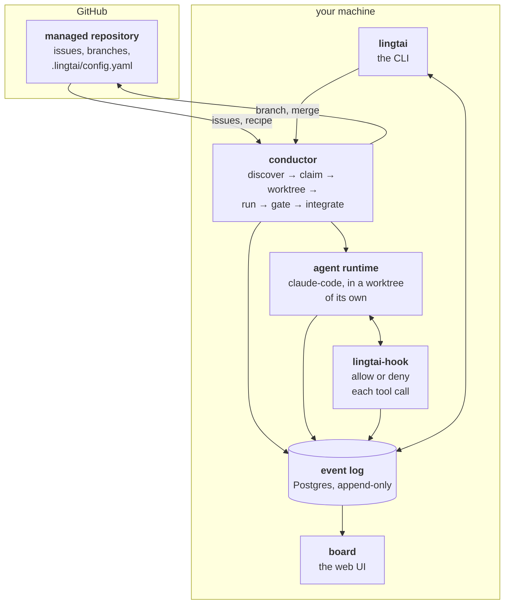
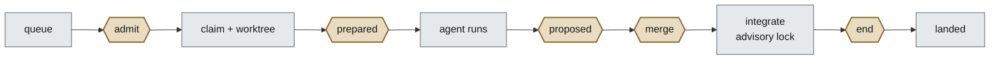

# Lingtai

**One agent loop, driven by an append-only event log. Everything else is a
projection of that log or a subscriber to it.**

That sentence is the whole design, and the load-bearing word is *log*, not
*event*. Plenty of systems are event-**driven** and still keep authoritative
mutable state somewhere. Here the log is the only truth: every table is
derived, can be dropped, and rebuilds to exactly what it was
([ADR 0014](doc/decisions/0014-one-loop-one-log.md)).

An lingtai is the part of a clock that lets the mainspring out one tooth at a
time. Without it the spring releases all at once. That is the job: take a queue
of work, hand each item to an agent, hold it at a series of gates, and release
it only when every gate — including a human one — has passed.

It replaces `agent-loop.sh`, a bash harness that worked 73 tickets against one
repository over four days. That harness kept its state in GitHub labels, its
history in issue comments, and its telemetry in a log file nobody parsed, and
was driven by a timer. It could not answer *what state is this ticket in*, *why
did this not merge*, or *what is waiting on me*. Everything here follows from
making those three the same append-only log.

## Status

**Phases 0 and 1 are done.** `nextloom-ai-admin` #155 went from a GitHub issue
to `be25a20` on `develop` on 2026-09-01 — recipe, claim, worktree, install,
Claude Code, the build gate green in 22.3s, a hold at the merge gate, one click,
and the merge lane under its advisory lock. 13 turns, $0.86. #120 landed the
same way. It took four attempts and each failure bought a real defect; the
[roadmap](doc/roadmap.md) has the table.

**Phase 2 stages 2a-2d are built, and 2a is verified.** `lingtai daemon` holds the
projections and takes work, driven by completion events rather than a timer,
and `lingtai pause` stops it. The `Reconciled` pass for orphaned worktrees and the
webhook route are both in. On 2026-09-02 admin #156 went queue to landed at
`06e8bbe` from a single `lingtai now`, with no command issued after it and the
completion event driving the next pass by itself — 15 turns, $0.83
([experiment 006](doc/experiments/006-the-loop-closes-unattended.md), which
also lists what that run did *not* prove).

**Phase 3 — the settled model — is done.** 3a-3f, against
[ADR 0016](doc/decisions/0016-the-settled-model.md): the guard is gone and
Lingtai restricts no tool call, the policy layer is gone, and what used to be
four gate *kinds* is five gate **points** whose actions come from the recipe. On
2026-09-02 admin #157 and #158 both went queue to landed on the new model — 8
turns, $0.63, 49.9s and 6 turns, $0.55, 50.8s — each with the build gate green
and each **closed on GitHub by an action at the `end` point** rather than by a
person ([experiment 009](doc/experiments/009-the-end-gate-closes-its-own-issue.md)).

The third run of that sitting is the more useful one: 30 turns and $1.82 spent
to produce **no commits**, refused before the gates and the work item released.
Nothing merged, and the log says why — which is the whole point of the refusal
being typed.

**Watch it.** Nothing has run unattended for long enough to have earned trust,
and `lingtai pause` exists because that is the honest state to be in. The log is
56 events across ten streams; two of the three runs in it landed. `lingtai pause`
has been used twice for real, both times because the queue offered work that had
already been merged.

**New here?** [`doc/tutorial.md`](doc/tutorial.md) is the shortest path from
nothing to an issue merged unattended.

See [`doc/roadmap.md`](doc/roadmap.md) for the phases and
[`doc/README.md`](doc/README.md) for what is settled and what is open.

## Terms

Most of these are ordinary event-sourcing words. They are collected here because
the rest of this file uses them without stopping, and one of them — *projection*
— is the difference between reading the log and reading a table built from it.

### The log, and things derived from it

| Term | What it is |
|---|---|
| **event** | One fact that already happened, in the past tense: `WorkItemClaimed`, `GateEvaluated`, `RunFailed`. Never edited, never deleted. |
| **the log** | The `events` table. Every component writes here and nothing keeps private state, which is why the board and the CLI cannot disagree. |
| **stream** | The events about one thing, in order — one work item, one run, one project. `stream_id` plus a `version` that counts from 1. |
| **`UNIQUE (stream_id, version)`** | The whole of the concurrency control. Two writers racing to append version 7 means one of them loses at the database, not at a lock somebody remembered to take. |
| **state** | A stream folded into an answer — *is this claimed?*, *did this merge?*. Computed in `packages/core`, which does no I/O, so it tests without a database. |
| **projection** | **A regular Postgres table built by replaying the log.** It holds no truth of its own: delete it and it can be rebuilt exactly. It exists so a question can be a plain `select` instead of a fold over thousands of events. |
| **checkpoint** | How far a projection has replayed, in the `checkpoints` table. A projection behind the log is *stale*, not wrong — it will catch up. |
| **upcaster** | A function that reads an event written in an older shape and returns the current one. An unbroken chain from version 1, because old events are never rewritten to match new code. |

There are two projections:

| Name | Feeds | Rebuild with |
|---|---|---|
| `task_view` | The board, `lingtai status`, and what the conductor takes next | `lingtai projection rebuild task_view` |

`task_view` holds one row per task and **only what a card shows**. Gate
evidence, findings, the diff and the trips themselves are folded from the event
stream when somebody opens a task — a list view and a detail view have opposite
economics, and only the list has to be cheap. See
[ADR 0012](doc/decisions/0012-one-task-view.md).

`lingtai projection lag` shows how far behind each one is. `rebuild` drops the
table, resets the checkpoint and replays from the beginning — safe by
construction, because the log is the only thing that was ever authoritative,
and possible only because no projection reads the clock.

**The daemon advances them.** `lingtai daemon` holds one advisory lock and follows
the log; there is no timer, because Postgres notifies on every append.

**`lingtai run` catches them up on its way out.** A command that appends and
returns would otherwise leave the board exactly where it was — a correct log
and a screen showing nothing moving, which is what nine runs by hand looked
like. It is not a second follower: it advances each projection to the head and
stops. The board is therefore right the moment the command returns, and stale
only *during* the run. Being current *throughout* is what the daemon is for.

### Lingtai's own words

| Term | What it is |
|---|---|
| **task** (work item) | One ticket under management, from the moment it is claimed to the moment it lands or is dropped. What a board card shows. |
| **the queue** | What GitHub currently lists that the recipe will take, minus what the log says is claimed. **Not in the log** — Lingtai never decided which issues exist ([ADR 0012](doc/decisions/0012-one-task-view.md)). |
| **daemon** | The one process that holds the conductor and the projection follower. The board controls it and watches it; it never holds work ([ADR 0013](doc/decisions/0013-daemon-hosts-the-work.md)). |
| **run** | One attempt at a work item. A work item can have several; each gets its own worktree, its own agent process and its own id. |
| **recipe** | `.lingtai/config.yaml`, committed **in the managed repository**. Its team decides what may be picked up, what environment it gets, what must pass. Read from `origin/<base>`, never from the agent's branch. |
| **gate** | One of **five fixed points in the loop** where the conductor waits for a verdict: `admit`, `prepared`, `proposed`, `merge`, `end`. The set is closed. A gate is a *place*, not a kind of check. |
| **action** | What runs at a point, from the recipe: `run` a command, `agent` a cold reviewer, `watch` some globs, `human` a person, `close`/`labels` an effect at `end`. Verdicts are bound to **one commit**, so a force-push invalidates them by arithmetic. |
| **skipped** | A point nobody configured. It is *shown*, never omitted — a point that is merely absent is indistinguishable from one that was configured and silently did not run. |
| **tier** | How contained the agent runtime must be: `open`, `guarded`, `sandboxed`. The recipe's, in `runtime.tier`. |
| **mirror** | Lingtai's own bare clone of a managed repository, at `~/.lingtai/repos/<project>.git`. Never your checkout. |
| **worktree** | The disposable checkout a run works in, cut from the mirror and removed when the run ends. |
| **integrate** | The merge lane: under a Postgres advisory lock, merge the base in, verify, merge out. Every exit path appends an event, including the failures. |

## How it fits together

There are two sides, and almost everything confusing about the configuration
comes from not knowing which side a thing is on.

**Lingtai runs on one machine of yours.** It owns a Postgres database, a
clone of each repository it manages, and the agent processes it starts.

**The repositories it manages live on GitHub and stay ordinary.** Nothing is
installed in them. There is no bot account, no webhook, no CI job, no label
state machine — one committed file, `.lingtai/config.yaml`, and that is all.
If you deleted Lingtai tomorrow the managed repository would not notice.



The log in the middle is the point. The conductor, the agent, the hook and the
gates all write to it, and the board and the CLI only read from it. Nothing has
private state, so *what state is this ticket in*, *why did this not merge* and
*what is waiting on me* are all the same query against the same table. The bash
harness this replaces kept those three answers in GitHub labels, issue comments
and an unparsed log file respectively, which is why it could answer none of them.

### The pieces

| | What it is | What it does not do |
|---|---|---|
| **conductor** | The scheduler. Finds work, claims it, cuts the worktree, starts the agent, runs the gates, merges. Everything it decides, it appends. | Never edits code itself. |
| **agent runtime** | The thing that actually writes the code — Claude Code today, in a worktree and an environment of its own. | Never talks to GitHub, and never sees a secret the recipe did not name. |
| **lingtai-hook** | A small binary Claude Code calls before every tool use. Exit 0 allows, exit 2 denies. Fails closed on anything it cannot understand. | Not a security boundary — see below. |
| **gates** | Five fixed points, each running the actions its recipe declares. A point with nothing configured is skipped, and the skip is rendered. | Not tied to a ticket, so a force-push invalidates a verdict by arithmetic. |
| **board** | Reads `task_view` and shows one card per work item, with its diff, its cost and every gate point — including the skipped ones. Approve, Reject and Waive are on the card. | Cannot advance its own projection — see [Terms](#terms). |
| **daemon** | `lingtai daemon` — one advisory lock, the projection follower and the conductor. Wakes on a completion event; there is no timer. | Never killed a running agent. Pause stops it *taking* work. |
| **lingtai** | Configures projects, drives runs by hand, and controls the daemon: `pause`, `resume`, `now`. | — |

The hook deserves the caveat it gets. It is a *coordination* mechanism, not a
sandbox: an agent that wants to get around it can. The three boundaries that
actually hold are the filtered environment, the isolated worktree and the
runtime sandbox — see [ADR 0007](doc/decisions/0007-dual-runtime.md).

### What you configure, and why each one exists

Three things, and they are on different sides of the line.

| | Where it lives | Why it exists |
|---|---|---|
| **A Postgres database of its own** | `.env.local` here, two connection strings | The log is the product, not a side effect. It must **not** be a managed project's database — Lingtai has to keep running while that project is the thing being changed. |
| **A GitHub App** | `.env.local` here, App ID + private key | It reads issues and pushes branches as something that is not you. A fine-grained token can be wrong in a way nothing reports: one covered a repository's submodule but not the repository, and every run failed with a 403 that said nothing about scope. An installation makes reachability explicit and checkable — `lingtai add` verifies the four permissions before it writes anything. |
| **A recipe, per managed repository** | `.lingtai/config.yaml`, committed **in that repository** | The repository's own team decides what an agent may pick up, what environment it gets, and what must pass before anything merges. It ships with the code and is reviewed like code. |

The board and the CLI need no configuration of their own. They read the same log
the conductor writes, which is what makes them consistent by construction rather
than by discipline.

**The recipe is the whole of what a run obeys.** Nothing sits above it — there
is no second, privileged configuration that the managed repository cannot see.
It is a workflow file, and it is reviewed the way one is.

What Lingtai owns is *where* it is read from: `origin/<base>`, never the agent's
branch. So an agent that edits it changes nothing about the run in flight — the
edit shows up in the diff, a `watch` action catches it, and it takes effect only
after a person approves and merges it. See
[ADR 0005](doc/decisions/0005-config-in-target-repo.md).

### The loop, and the five places it stops



The rectangles are the loop's own work and are not configurable. The hexagons
are **gates** — the five points where the conductor stops and waits for a
verdict — and what runs at each is the recipe's.

| Point | When | May refuse? |
|---|---|---|
| `admit` | the queue offers an item, before it is claimed | yes — it stays queued |
| `prepared` | the worktree exists, before the agent starts | yes — refuse before money is spent |
| `proposed` | the agent stopped and there are commits — a change has been proposed | yes |
| `merge` | after `proposed` passes, before the merge lane | yes |
| `end` | the item reached any terminal outcome | **no** — its actions are effects |

**The set is closed.** No sixth point will ever be added. What runs *at* a point
is open, which is what lets extension be unbounded while the core stays finite:
adding a security scan or a second reviewer is a line in a recipe, not a change
here. `end` is the one that cannot refuse — nothing can be stopped once a merge
has landed — and calling it a gate anyway is a deliberate imprecision, recorded
rather than smoothed over.

**A point nobody configured is skipped, and the skip is shown.** That is the
condition everything else rests on. A gate with nothing at it does not run, and
that is your decision, not a defect; a gate that *was* configured and did not
run is Lingtai's bug. Those two are only distinguishable if the empty ones
are rendered, so the board and `lingtai add` list all five, always.

```
admit     (skipped)
prepared  (skipped)
proposed  build
merge     (skipped)
end       close the ticket
```

### What a recipe says

The shape is GitHub Actions': a `name`, one key saying what kind of thing this
is, and its parameters beside it.

```yaml
gates:
  admit: []
  prepared: []

  proposed:
    - name: build
      run: pnpm typecheck && pnpm lint && pnpm test
      timeout: 15m

  merge:
    - name: migrations          # a watch hold, by path
      watch: ["prisma/migrations/**"]
      then: request-approval
    - name: approval            # a person, and the question they are asked
      human: Merge {branch} into {base}?

  end:
    - name: close the ticket
      when: landed
      close: true
```

Order within a point is the array's, the first refusal wins, and the actions
after it do not run — continuing would spend money producing verdicts about a
diff that is not going anywhere.

### What Lingtai does not do

**It does not restrict tool calls.** Nothing intercepts them and nothing keeps
a list. Tool limits belong to the agent runtime's own configuration —
`permissions.deny` in `~/.claude/settings.json` or in the managed repository's
`.claude/settings.json` — which holds even under `--permission-mode
bypassPermissions`, and holds by *removing the tool from the model's list* so
nothing is ever attempted
([experiment 008](doc/experiments/008-deny-survives-bypass.md)).

Containment is the **filtered environment** and the **disposable worktree**.
Neither was ever the guard's, and both still hold.

**It does not second-guess your workflow.** Nothing sits above a repository's
own recipe. `lingtai doctor` reports what else is configuring a run — your
`~/.claude/settings.json` is in scope for every one, because Lingtai cannot
set `HOME` without breaking the runtime's own credentials. Being unable to
control that is acceptable. Being unable to see it is not.

### What one run actually does

`lingtai run nextloom-ai-admin --issue 120`, end to end — and the same eight steps
the daemon takes for you:

1. **Resolve the recipe** from `origin/develop` — the base recorded when the
   project was registered, not whatever GitHub currently calls the default
   branch. (Those differ more often than you would think; the repository this
   was first run against had a feature branch as its default.)
2. **Claim the issue** — an event, so two schedulers cannot take the same one.
3. **Cut a worktree** from Lingtai's own mirror. Never your checkout.
4. **Plant a filtered environment file.** Only the variable names the recipe
   *requires* exist in it, resolved from [three layers](#the-three-layers).
   Everything else is *absent*, not redacted — and a required name with no value
   refuses the project at step 1, before the claim.
5. **Start the agent** with the hook wired in, at the tier the recipe asks for.
6. **Run the gates** in recipe order, stopping at the first refusal.
7. **Integrate** under a Postgres advisory lock: merge the base in, verify,
   merge out. Every exit path appends an event — including the failures.

Step 7 is shaped the way it is because of one expensive silence. The old
harness's integrate step had six `return 1` paths and not one of them emitted a
log line, a comment or a label; two tickets re-ran five times for roughly $29
while the actual cause — uncommitted work in the operator's own checkout — was
never reported by anything at all.

## Layout

| | |
|---|---|
| `packages/core` | Event catalogue, upcasters and aggregate reducers. Zero I/O, so it tests without a database. |
| `packages/env` | Where configuration values come from, for everything else. |
| `packages/store` | The Postgres event store: append, read, subscribe, and the projection runner. Prisma 8 for reads and writes, `pg` for `LISTEN/NOTIFY`. |
| `packages/config` | The recipe schema, the presets, and the watch globs a recipe compiles to. |
| `packages/github` | The App: JWT, installation tokens, and a **read-only** client. Writes go through git. |
| `packages/conductor` | Discovery, the queue, claiming, worktrees, the hook socket, and the merge lane. |
| `packages/gates` | The gate pipeline, and the four action kinds that produce a verdict. |
| `packages/runtime` | Containment tiers, and starting Claude Code. |
| `packages/hook` | `lingtai-hook` — the binary Claude Code calls before every tool use. |
| `apps/cli` | `lingtai` — `add`, `run`, `approve`, `status`, `doctor`, `projection`. |
| `apps/board` | The web UI. Real cards, read from the projection. |
| `doc/` | The design, every decision, and the experiments that back them. |

## What it writes to disk

**Nothing in your checkout of the managed repository.** `lingtai add` takes a
GitHub coordinate — `steven-zhc/nextloom-ai-admin` — not a local path, and
Lingtai clones its own copy. Your working tree is never read, never written
and never looked at, which is the whole reason the integrator exists: the old
harness merged in the operator's own checkout, and uncommitted work there is
what made #58 and #59 re-run five times for roughly $29 with nothing reporting
why.

Everything lives under `LINGTAI_HOME`, which defaults to `~/.lingtai`:

```
~/.lingtai/
├── env/<project>.env            your values, per project — persistent
├── repos/<project>.git          bare mirror — persistent
├── worktrees/<project>/<runId>  one per run — disposable
└── runs/<runId>/settings.json   the hook wiring
```

| | Lifetime | Why there |
|---|---|---|
| `env/<project>.env` | Persistent | **Yours, and the only file layer.** One connection string per project, so two projects can want the same variable name and mean different things — see [The three layers](#the-three-layers). Not re-clonable; the one thing here worth backing up. |
| `repos/<project>.git` | Persistent | Expensive. The first clone is a network round trip; after that every run is a `fetch`. This is why cutting a worktree took 1.7s in [experiment 005](doc/experiments/005-rung-1-reaches-a-real-repository.md). |
| `worktrees/<project>/<runId>` | One run | Cheap. Cut from the mirror, removed when the run ends — and removed *before* the integrator runs, because a worktree holding `agent/<n>` checked out stops git updating that ref. |
| `runs/<runId>/settings.json` | One run | **Outside the worktree, deliberately.** An agent that can edit its own hook configuration has no hook configuration. |
| `$TMPDIR/lingtai/*.sock` | One run | The hook's socket. In `$TMPDIR` rather than under `LINGTAI_HOME` because a unix socket path has a hard 104-byte limit and a home directory plus a run id exceeds it — see [ADR 0011](doc/decisions/0011-hook-latency-is-runtime-startup.md). |

Two things in this repository are also not committed: `.env.local`, and
`packages/hook/bin/lingtai-hook` — a 55 MB compiled binary that `pnpm --filter
@lingtai/hook build` produces.

**`rm -rf ~/.lingtai/repos ~/.lingtai/worktrees ~/.lingtai/runs` is safe.**
Everything in those is either re-clonable from GitHub or belongs to a run that is
over. The part that matters — the event log — is in Postgres, and none of it is
here. `~/.lingtai/env` is the exception: you wrote it, nothing else has a copy,
and deleting it makes every project that requires a value refuse by name until
you write it again.

[#18]: https://github.com/steven-zhc/lingtai/issues/18
[#19]: https://github.com/steven-zhc/lingtai/issues/19
[#20]: https://github.com/steven-zhc/lingtai/issues/20
[#28]: https://github.com/steven-zhc/lingtai/issues/28

## Getting started

```bash
pnpm install
cp .env.example .env.local        # then paste the connection string
pnpm contract:emit                # offline — no database needed
pnpm typecheck
```

`.env.local` lives at the repo root and is gitignored. A real environment
variable beats it, which is what makes CI and launchd work with no file at all.

**Two connection strings, one database.** `DATABASE_URL` is pooled, for ordinary
queries; `DIRECT_DATABASE_URL` is session mode, for migrations, `LISTEN/NOTIFY`
and advisory locks. A transaction pooler breaks all three, and breaks them
without erroring — see [ADR 0009](doc/decisions/0009-two-connections.md).

The event store must be **its own database**, not one belonging to a managed
project — Lingtai has to keep running while a managed project is the thing
being changed.

**The tests need a third and fourth string, and refuse to run without them.**
`TEST_DATABASE_URL` and `TEST_DIRECT_DATABASE_URL` point at a *different*
database. The suite is not mocked — it appends real events, runs real
projections and takes real advisory locks — so pointed at your own log it
leaves work items and board cards behind. It did: twenty-four cards from ten
throwaway `esctest*` projects, and none from a real one. Cleaning that up is
not cheap either, because rebuilding a projection replays the log and brings
the cards straight back; the only way to remove them is to delete from an
append-only table.

Give the test database its schema the same way the main one gets it, with
`LINGTAI_TEST=1` in front — see [Bringing the database up](#bringing-the-database-up).

**And a fifth place, if Lingtai is to work on Lingtai.** An agent working this
repository has to run this suite, so its recipe requires the two `TEST_*` names
— which are `RESERVED` and therefore never reach an agent from your shell,
however a recipe declares them. Copy them into the project's own file:

```bash
mkdir -p ~/.lingtai/env
grep '^TEST_' .env.local > ~/.lingtai/env/lingtai.env
```

Without it, every run against this repository refuses by name before it claims
anything. `pnpm lingtai doctor` says which layer each name came from. See
[The three layers](#the-three-layers).

**Empty its log now and then.** The suite cleans up its own streams but the log
only grows, and one test rebuilds a projection — which replays the whole log, so
its cost is the log's length. After a few weeks that test crossed its 60s
timeout and started failing for reasons unrelated to the code it covers.

```bash
LINGTAI_TEST=1 pnpm --filter @lingtai/event-store db:reset-test
```

It refuses twice over if you point it at anything else: the flag has to be set,
*and* the string it resolves has to differ from the one without the flag.

### Bringing the database up

Prisma 8 splits planning from applying. Planning is offline; only the second
half needs a reachable database.

```bash
pnpm db:init                      # create the tables and sign the database
pnpm db:bootstrap                 # apply notify.sql, then prove it worked
```

The test database takes the same two, with `LINGTAI_TEST=1` in front of each
so they resolve `TEST_DIRECT_DATABASE_URL` instead.

`db:bootstrap` is not optional and is not Prisma's job. Prisma models tables, not
triggers, so `notify.sql` carries the two things the schema cannot express: the
`NOTIFY` trigger every subscriber wakes on, and the rules that make `events`
append-only in the database rather than by convention. The script then asserts
ten properties, including a **cross-connection** NOTIFY — the check that catches
a transaction pooler, which drops notifications silently.

An initial migration is already planned and committed; `db:plan --name <slug>` is
only needed after the contract changes.

### Checking it

```bash
pnpm lingtai doctor                   # non-zero exit on any failure
pnpm lingtai projection lag           # how far each projection is behind the log
```

`lingtai doctor` never writes to the event log — every check reads the catalogue,
and the one exception is a `NOTIFY`, which touches no table. It holds a listener
open, pauses long enough for a pool to churn, and notifies from a second
connection, because a check that merely opens the direct connection passes
against a transaction pooler and proves nothing
([experiment 003](doc/experiments/003-doctor-catches-a-pooler.md)).

Checks that depend on code Phase 1 has not written yet print as `skip`, naming
the issue that will fill them in.

## Connecting GitHub

Lingtai talks to GitHub as a **GitHub App**, not as a personal access token.
The reason is a measured failure: on 2026-08-30 a fine-grained PAT covered the
admin repository's *submodule* but not the repository itself, and every CI run
failed with a 403 that said nothing about scope. An App's reach is explicit in
its installation, so `lingtai add` can ask and answer that question at onboarding
time instead of a day later. See
[ADR 0006](doc/decisions/0006-github-app.md).

This part cannot be automated: creating an App is a browser step, and the
private key it hands you is a real secret.

### 1. Create the App

Go to **Settings → Developer settings → GitHub Apps → New GitHub App**
(<https://github.com/settings/apps/new> for a personal account).

| Field | What to put |
|---|---|
| **GitHub App name** | Anything free — it is globally unique. `lingtai-<your-handle>` works. |
| **Homepage URL** | Required by the form and otherwise unused. The repository URL is fine. |
| **Webhook → Active** | **Uncheck it.** Webhooks arrive with [#28](https://github.com/steven-zhc/lingtai/issues/28); until then there is nothing listening and a failing delivery is noise. |
| **Where can this App be installed** | *Only on this account.* |

Then, under **Repository permissions**, set exactly these four:

| Permission | Level | What Lingtai does with it |
|---|---|---|
| **Issues** | Read and write | reading work items, writing `agent:*` labels and comments |
| **Contents** | Read and write | cloning, pushing `agent/*`, merging into the base branch |
| **Pull requests** | Read and write | opening and reading pull requests |
| **Metadata** | Read-only | mandatory; GitHub selects it for you |

Leave every other permission at *No access*. `lingtai add` checks these four by name
and refuses to onboard a repository that is missing one, so a gap becomes a
message at onboarding rather than a 403 in the middle of a merge.

Click **Create GitHub App**.

### 2. Take the App ID and a private key

On the App's **General** page:

- **App ID** — a number near the top. This is `GITHUB_APP_ID`.
- **Private keys → Generate a private key** — this downloads a `.pem` file, and
  GitHub will not show it to you again.

Move the `.pem` somewhere **outside this repository**. It is the one credential
that is not short-lived, and `.gitignore` is not a place to rely on for it:

```bash
mv ~/Downloads/lingtai-*.private-key.pem ~/.lingtai-app.pem
chmod 600 ~/.lingtai-app.pem
```

### 3. Install it on the repositories it should manage

**Install App** in the left sidebar → your account → **Only select
repositories** → pick each repository Lingtai will manage.

An App that exists but is not installed on a repository is the exact failure
0006 is about, and `lingtai add` reports it as such:

```
the GitHub App is not installed on steven-zhc/nextloom-ai-admin. Install it on
that repository (Settings → GitHub Apps → Configure), then run lingtai add again.
```

### 4. Point Lingtai at it

In `.env.local` at the repository root:

```bash
GITHUB_APP_ID=123456
GITHUB_APP_PRIVATE_KEY_PATH=~/.lingtai-app.pem
```

`~` is expanded, and a relative path is relative to *this repository's root* —
not to whichever directory you ran the command from. Where only a single-line
value can be carried, `GITHUB_APP_PRIVATE_KEY` takes the PEM itself with `\n`
escapes instead.

No installation id is needed. It is looked up per repository, which is what
turns "the App is not installed there" into a sentence rather than a 404.

Check it:

```bash
pnpm lingtai doctor
```

```
  ok   github: app credentials
       app 123456, key from ~/.lingtai-app.pem · requires issues:write,
       contents:write, pull_requests:write, metadata:read (verified per
       repository by lingtai add)
```

That check parses the key to prove it is a key rather than a path typo or a
truncated paste. It does **not** contact GitHub — whether an installation
actually grants those four permissions is a per-repository question, and
`lingtai add` is what asks it.

## Onboarding a repository

### 1. Give the repository a recipe

Lingtai reads `<repo>/.lingtai/config.yaml` **from the base branch**,
never from the branch an agent is working on. An agent that edits this file
changes nothing about the run in flight; the edit shows up in the diff and takes
effect from the next work item. That rule is borrowed from GitHub Actions and is
[ADR 0005](doc/decisions/0005-config-in-target-repo.md).

Commit this to the base branch of the repository being managed — not to
Lingtai:

```yaml
version: 1

repo:
  base: develop
  # `git worktree add` does not populate submodules, and a worktree without them
  # fails every test that imports one — which reads on the board as though the
  # agent broke them.
  submodules: true

source:
  # Also the priority order: earlier wins.
  kinds: [bug, tech-debt]
  # Labels of yours that keep the agent off a ticket.
  exclude: [blocked, needs-design]

env:
  # Variable NAMES only, never values — so this file is safe to commit.
  #
  # `required` means what it says: a name here with no value in any layer
  # refuses this project for the whole pass, before an issue is claimed and
  # before an agent is started.
  required:
    - LOCAL_DATABASE_URL
    - CLERK_SECRET_KEY
  # Rarely the repository root: Next, Prisma and vitest read it from the app
  # directory.
  plantAt: apps/web/.env.local

gates:
  - kind: process
    name: build
    run: pnpm verify
    timeout: 15m

runtime:
  agent: claude-code
  limits:
    turns: 300
    wall: 2h
```

A shorter form, if the project is an ordinary pnpm workspace:

```yaml
version: 1
extends: pnpm-workspace
repo:
  base: develop
source:
  kinds: [bug]
env:
  required: [LOCAL_DATABASE_URL]
  plantAt: apps/web/.env.local
```

`extends` fills in the submodule default, a `pnpm verify` build gate and the
runtime. It resolves to the same run as spelling all of it out, and hashes the
same — a preset's *name* is not part of what a run does, so it is not part of
the hash.

Four action kinds produce a verdict, and all four run. `run` and `human` need
nothing from the caller; `agent` needs a reviewer and `watch` needs the diff's
file list, and `run-once` supplies both. A recipe naming a kind whose dependency
is missing is **refused** by name rather than skipped — a pipeline that silently
dropped a human approval would put a green board on a change nobody approved.
(`close` and `labels` are the other two: effects, not verdicts, and only at
`end`.)

#### The three layers

The recipe declares **names**. The values come from three layers with three
different owners, merged in order — later wins:

| | Source | Who owns it | Example |
|---|---|---|---|
| 1 | `process.env`, restricted to a fixed list | Lingtai | `PATH` `HOME` `USER` |
| 2 | `process.env`, **only the names the recipe requires** | your machine, set once | `OPENAI_API_KEY` |
| 3 | `~/.lingtai/env/<project>.env` | you, per project | `LOCAL_DATABASE_URL` |

```bash
mkdir -p ~/.lingtai/env
cat > ~/.lingtai/env/nextloom-ai-admin.env <<'EOF'
LOCAL_DATABASE_URL=postgresql://localhost:5432/admin_dev
EOF
```

Layer 3 exists because layer 2 has one global home: two projects wanting
`DATABASE_URL` to mean different things cannot both be expressed in your shell.
A `!` prefix on a value is reserved for a secret source (`SECRET=!op read
op://…`), which is not built — quote a value that really does begin with one.

**A name Lingtai uses for itself never comes from layer 2.** `DATABASE_URL`,
`DIRECT_DATABASE_URL`, `TEST_*` and `GITHUB_APP_*` are refused there however a
recipe declares them, because a recipe is written by the repository an agent is
editing. Layer 3 is a file you wrote, so it is not blocked — which is what lets
Lingtai's own recipe require `TEST_DATABASE_URL` while nobody else's can reach
for it.

**A declared name with no value refuses the whole project for that pass**, before
the issue is claimed: no worktree, no agent, no money. This used to be a log
line, and one run spent $0.97 over ten turns against a database it could not
reach. See [ADR 0020](doc/decisions/0020-the-agent-environment-in-layers.md).

```bash
pnpm lingtai doctor    # per project: every required name and which layer it came from
```

`doctor` prints names and layers, never values.

### 2. Register it

```bash
pnpm lingtai add steven-zhc/nextloom-ai-admin
```

It checks the installation and its permissions **before** it writes anything, so
a half-onboarded project is not a state that exists. Then it reads the recipe
from the base branch, hashes it, and records `ProjectConfigured`.

There is nothing else to write. The tier, the gates and the priority order are
all the recipe's, in the managed repository — which is why this command takes a
slug and a branch and nothing more.

### 3. Check it

```bash
pnpm lingtai status nextloom-ai-admin              # what is runnable, and what is holding the rest
pnpm lingtai status nextloom-ai-admin --refresh    # ask GitHub first
```

Without `--refresh` this answers from the queue projection, which nothing writes
to until a run or the daemon has taken a pass — so on a freshly registered
project it says `queue: empty` however much work GitHub is offering. `--refresh`
asks GitHub, writes the queue, and reports **what it passed over and why**:

```
nextloom-ai-admin  base=develop
  from GitHub: 9 runnable, 29 passed over — excluded-label 29
  queue: 9 runnable
    #154   bug         [Bug] The resolve-aliases destination search has no request sequencing…
    #110   enhancement [Enhancement] /users still prints async job ids to copy…
```

It takes nothing, claims nothing and appends no event — the whole of what it
does is make the answer current. The absences are the half worth having: an
issue nobody is working on has a reason, and that reason is the recipe's.

Onboarding is done. How you actually run work is next.

## Running work

Two things have to exist before anything runs, and both refuse loudly rather
than degrading:

```bash
pnpm --filter @lingtai/hook build      # the guard binary; not committed
pnpm --filter @lingtai/board dev       # the board, on :3200
```

The board is a reader. It renders `task_view` and issues control events; it
never holds a run, which is why restarting it or closing the tab costs nothing
— see [ADR 0013](doc/decisions/0013-daemon-hosts-the-work.md).

A run without the hook does not start — a run with no guard is not a smaller
run, it is a different one.

`--no-guard` is the exception, and it is for bringing the pipeline up on a
machine you are watching. It wires no hooks at all: the settings file is still
written and still passed to the runtime, with an empty `hooks` object, so what
is in force is legible from the file rather than guessed from its absence. The
run says `guard OFF` every time it starts.

What it costs is real but bounded. Two of the three boundaries are untouched —
the environment is still filtered to what the recipe named, and the worktree is
still disposable and still not your checkout ([ADR 0007](doc/decisions/0007-dual-runtime.md)).
What you lose is the third: no tool call is refusable, and the run records no
guard trips and no touched files, so it proves less about what the agent did
than a guarded run does.

### Run one, and stop before it writes

The first thing to do with a repository, and the thing to keep doing until you
trust it:

```bash
pnpm lingtai run nextloom-ai-admin --issue 120 --no-merge
```

Discovery, claim, worktree, the `prepared` point, agent, the remaining gates — then it **stops** and asks.
The branch is pushed and every verdict is recorded; nothing is merged. You get:

```
held at 8f3a1c2 — wi-nextloom-ai-admin-120 is waiting on you
nothing was merged. Re-run without --no-merge to merge it.
```

### Let the daemon do it

```bash
pnpm lingtai daemon
```

One process, holding one advisory lock. It keeps the projections current and
takes work: a completion event — landed, released, blocked, refused — is what
tells it to pick the next one up, so the loop advances by itself with no timer
anywhere.

Running it while another copy is up is fine; the second exits saying who holds
the lock.

```bash
pnpm lingtai pause "the importer is flaky today"   # take nothing new
pnpm lingtai resume
pnpm lingtai now nextloom-ai-admin --issue 155     # one, ahead of the queue
```

**Pause stops it taking new work; a run in flight finishes.** Killing a running
agent is not implemented — a run you want gone ends when its lease expires and
the claim comes back. Said plainly because a Stop button that means Pause is
worse than no Stop button.

Control goes through the log, so a pause issued while the daemon is down is
waiting when it comes back.

It also comments on the ticket when something is waiting on you, sets an
`lingtai:*` label as a task moves, and sends a macOS notification for the
four things that mean nothing moves until you act. The comments and labels go
through an **outbox** — queued from the log, retried with backoff, and given up
on with a reason rather than retried forever. Notifications deliberately do
not: one delivered an hour late about a decision you already made is worse than
none.

`terminal-notifier` on your PATH makes a notification clickable, opening that
task's page. Without it they still arrive, and the daemon says which you got.

To keep it running across logout, sleep and crashes:

```bash
./scripts/launchd.sh install     # KeepAlive; there is no start button to press
./scripts/launchd.sh status
./scripts/launchd.sh uninstall
```

### Decide, on the board

Open <http://localhost:3200>. The card is in **Waiting on you** — title, state,
cost, gate counts — and Approve, Reject and Waive are on it, because deciding is
what the board is for.

Everything else is one click away. The card's title opens `/task/<id>`, which
folds that task's event stream on demand: each gate's verdict with its evidence,
the reviewer's findings with their failure scenarios, the guard trips, and the
raw history with every actor. Nothing on that page is maintained in a table — a
detail view is read rarely, by one person, about one task.

The page updates itself: Postgres notifies on every append, the daemon advances
the projection, and the board re-reads. If it stops moving, `lingtai doctor` says
whether the daemon is up and whether somebody paused it.

That is the whole bet: if deciding still means opening GitHub, nothing changed.

The same three decisions from the terminal, if you prefer:

```bash
pnpm lingtai approve nextloom-ai-admin --issue 120
pnpm lingtai approve nextloom-ai-admin --issue 120 --reject "wrong approach"
```

`approve` merges **what the held run actually produced**, not a fresh attempt.
If the branch moved since the run asked, it refuses and names both commits —
you would otherwise be merging something you have not read. A rejection sends
the item back to the gate, not back to the queue.

### Let it merge

Drop the flag once you are willing:

```bash
pnpm lingtai run nextloom-ai-admin --issue 120
```

It still stops for a person wherever the recipe says so — a `human` gate, or a
`watch` action that saw a migration.

### Take the queue

No `--issue`, and it picks work itself, in the recipe's priority order:

```bash
pnpm lingtai run nextloom-ai-admin --max 2    # Phase 2's exit criterion
pnpm lingtai run nextloom-ai-admin            # until nothing runnable is left
```

**`--max` matters more than it looks.** Without it this drains the queue, and a
queue you have not read is a bill you have not agreed to. Start bounded.

A pass will not attempt the same work item twice, even though a failed run
releases it back into the queue — that is what stops a broken ticket from
costing an agent call per lap. It stops with `exhausted` rather than `empty`
when work remains that it has already tried, because those are different facts.

The line it prints at the end is read back from the log, not counted up from
what the process did:

```
9 run(s): 1 landed, 7 held, 1 stopped (empty)
```

**landed** the work item's stream says `WorkItemLanded` — by this run, or by
the merge lane after somebody approved it on the board while the pass carried
on. **held** it is blocked on a question a person now holds. **stopped** it
ended, nothing landed, and nobody was asked anything. The exit code is non-zero
only for that last count.

### When something refuses

Every refusal names itself. The common ones:

| What you see | What it means |
|---|---|
| `the GitHub App is not installed on …` | Step 3 above — install it on that repository. |
| `the installation is missing permissions:` | Step 1's table; each gap is listed with what it has, what it needs and what it is for. |
| `no .lingtai/config.yaml on develop` | The recipe is missing from the **base branch**. A copy on the agent's branch is not read, by design. |
| `runtime: signed in — claude-code reports not signed in` | `lingtai doctor` asks in the environment a *run* gets, not yours. If you are signed in and this fails, that environment is missing something the credential store needs. `/login` will not help. |
| `no lingtai-hook binary at …` | `pnpm --filter @lingtai/hook build`. A run without the guard must not start. |
| `ENOENT … lingtai-app.pem` | The key path is wrong. `~` and relative paths both work; relative is from this repository's root. |
| `stopped at recipe: …` | The recipe did not parse, or names an action this build does not have. The message is the validation failure. |
| `stopped at env: … declared in env.required and not set in any layer` | The recipe requires a name nothing supplies. Nothing was claimed and nothing was spent. Set it on the machine, or write `~/.lingtai/env/<project>.env` — the message names the file. A name matching `RESERVED` can only come from that file. |
| `env.allow: Unrecognized key` | The recipe predates [ADR 0020](doc/decisions/0020-the-agent-environment-in-layers.md). Rename `allow:` to `required:` — the schema is strict so that a stale key fails loudly instead of resolving to "requires nothing". |
| `stopped at discover: excluded-label` | That issue carries a label the recipe's `source.exclude` names. Every reason an issue is passed over is the recipe's — there is no built-in list. |
| `stopped at prepare: the install action refused` | An action at the `prepared` point refused — usually dependencies that did not install in a fresh worktree. Nothing expensive ran; that is the point of failing here. |
| `did not merge (stale): the card showed …` | The branch moved between reading and deciding. Reload and read it again. |
| `a waiver needs a reason` | A waiver records who and why. Both, always. |
| `stopped: exhausted — 1 run(s)` | The queue still has work; everything left has already been tried this pass. Not the same as `empty`. |
