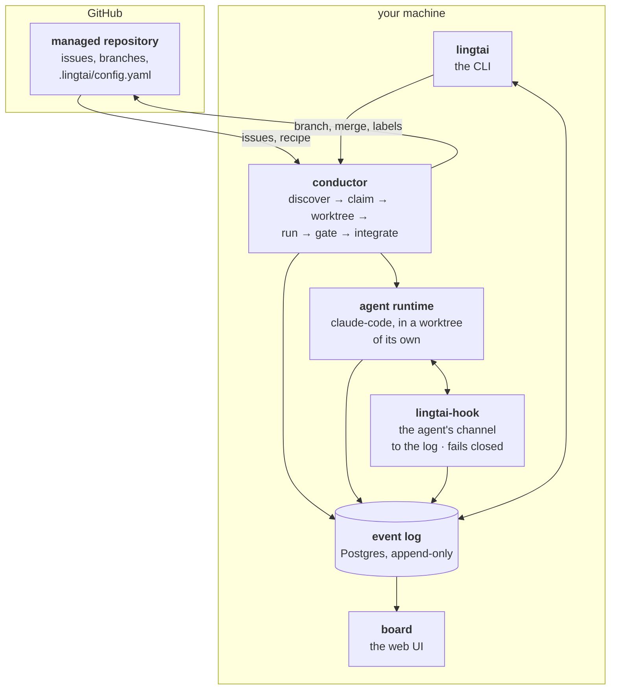
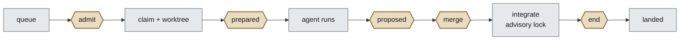

# Lingtai

**One agent loop, driven by an append-only event log. Everything else is a
projection of that log or a subscriber to it.**

Lingtai takes a queue of work, hands one item at a time to a coding agent, holds
it at a series of gates, and releases it only when every gate — including a human
one — has passed. Nothing advances without leaving a record of why.

## Why

Three questions decide whether you can leave a coding agent running:

- *what state is this ticket in?*
- *why did this not merge?*
- *what is waiting on me?*

Everything here follows from making those three **the same query against the
same table**. Scatter them — state in labels, history in comments, telemetry in
a log nobody parses — and each is answerable only by someone who already knows
where to look, which is near enough to not answerable at all.

The load-bearing word is **log**, not *event*: plenty of systems are
event-driven and still keep authoritative mutable state somewhere. Here the log
is the only truth — every table is derived, can be dropped, and rebuilds to
exactly what it was.

## Goals

| | |
|---|---|
| **Nothing decides in private** | Every component appends to one table and keeps no state of its own, so the board and the CLI cannot disagree. |
| **The managed repository stays ordinary** | One committed file, `.lingtai/config.yaml`. No bot account, no CI job, no label state machine. Delete Lingtai tomorrow and the repository would not notice. |
| **The repository's own team sets the rules** | What may be picked up, what environment it gets, what must pass. Nothing privileged sits above that file. |
| **A configured check that did not run is a bug** | Not a preference — the thing the design is built to make visible. An unconfigured gate is *shown as skipped*, never omitted, because absent and silently-not-run must be distinguishable. |
| **Refusing is cheap and early** | A missing environment value refuses the whole project before an issue is claimed: no worktree, no agent, no money. |

**Watch it.** Nothing has run unattended long enough to have earned trust, and
`lingtai pause` exists because that is the honest state to be in.

## The big picture

Lingtai runs on one machine of yours. It owns a Postgres database, a clone of
each repository it manages, and the agent processes it starts.

The log in the middle is the point. GitHub is an *input* — the authority on what
work exists — and an *output*, told what the log says. It is never where Lingtai
keeps what it did.

## The loop, and the five places it stops

The rectangles are the loop's own work and are not configurable. The hexagons
are the five points where the conductor stops and waits for a verdict — and what
runs at each is the recipe's.

| Point | When | May refuse? |
|---|---|---|
| `admit` | the queue offers an item, before it is claimed | yes — it stays queued |
| `prepared` | the worktree exists, before the agent starts | yes — refuse before money is spent |
| `proposed` | the agent stopped and there are commits | yes |
| `merge` | after `proposed` passes, before the merge lane | yes |
| `end` | the item reached any terminal outcome | **no** — its actions are effects |

**The set is closed.** No sixth point will ever be added. What runs *at* a point
is open, which is what lets extension be unbounded while the core stays finite:
adding a security scan or a second reviewer is a line in a recipe, not a change
here.

## The architecture, in one screen

Thirteen packages in two columns. **Nothing on the left names anything on the
right** — `conductor` declares the interfaces it needs, the right column
implements them, and a host wires the two together.

| Decides · no I/O of its own | Touches the world · one thing each |
|---|---|
| **`conductor`** the order of one pass, and the ports it needs | **`event-store`** Postgres: append with a version, subscribe from a seq |
| **`actions`** what runs at a point, and what its verdict means | **`projector`** the fold, and the checkpoint in the same transaction |
| **`agent-env`** what the agent's environment holds | **`github`** the App, the token, issues and labels |
| **`recipe`** what the managed repository asked for | **`repo`** git: the mirror, the worktree, the merge lane |
| **`domain`** the vocabulary: event types, streams, reducers | **`agent`** starting the process, hearing it back on the socket |
| | **`env`** the *machine's* credentials, and its state directory |
| | **`hook`** one Bun binary, inside the agent's sandbox |

Two hosts assemble them — `apps/cli` and `packages/daemon` — plus `apps/board`,
which reads the projection and appends decisions. **Every process that appends
holds a projector while it runs**, so the board follows a run by hand just as it
follows the daemon. The daemon adds what only a long-lived process can owe: an
advisory lock, a heartbeat, a repair at startup, and a loop that keeps taking
work.

There is **one projection**, `task_view`, rebuilt with
`lingtai projection rebuild task_view`. Anything else you want to know is folded
from the log on demand.

## Where to read next

| | |
|---|---|
| [`doc/architecture.html`](doc/architecture.html) | **Start here.** Six diagrams answering *which process am I in* — who appends, who is told, where state lives, how GitHub is brought back into line. Also in [中文](doc/architecture.zh.html). |
| [`doc/tutorial.md`](doc/tutorial.md) | The shortest path from nothing to an issue merged unattended. |
| [`doc/operating.md`](doc/operating.md) | Everything you actually type: setup, the GitHub App, onboarding a repository, running work, and what every refusal means. |
| [`doc/README.md`](doc/README.md) | The decision log — one file per decision, append-only in spirit — and what is still open. |
| [`doc/reference.md`](doc/reference.md) | Every term, and everything currently in it: 38 event types, 5 gate points, 4 action kinds. |
| [`doc/roadmap.md`](doc/roadmap.md) | The phases, each with an exit criterion that is a fact. |
| [`doc/design.md`](doc/design.md) | How it is meant to work, as a whole. |

## Status

Phases 0–3 are done. `nextloom-ai-admin` #155 went from a GitHub issue to a
commit on `develop` on 2026-09-01; #156 closed the loop unattended on 09-02; and
#157 and #158 landed on the settled model, each **closed on GitHub by an action
at the `end` point** rather than by a person.

The third run of that sitting is the more useful one: 30 turns and $1.82 spent
to produce **no commits**, refused before the gates and the work item released.
Nothing merged, and the log says why — which is the whole point of the refusal
being typed.

Lingtai now runs on itself: the tickets in this repository are worked by agents
Lingtai dispatched. See [`doc/roadmap.md`](doc/roadmap.md) for what is proven and
[`doc/README.md`](doc/README.md) for what is not.
