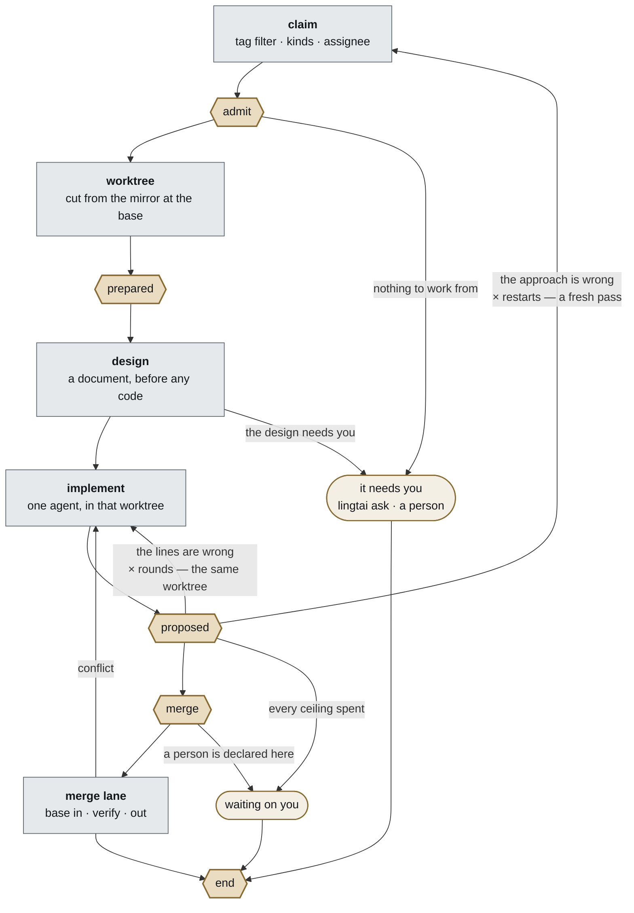

# 0058 — Lingtai is a development pipeline, and a pass is nine stations

**Status** **proposed** · 2026-09-22 · **the first ADR here that is not
`accepted`**, deliberately: §2's division is the foundation everything else
rests on, and it is under discussion. · **revises
[0015](0015-five-gates-and-two-extensions.md)'s framing and none of its rules**

Lingtai is not a general workflow engine with five extension points. It is a
development pipeline whose shape is fixed, and the five points are the places
where it *judges*. The other four stations are where it *works*, and they are as
configurable as the five — but they never produce a verdict.

## Context

### The thing that got built is git-, diff- and issue-shaped

Every station names something specific to software development, and none of
them would survive being asked to run a different kind of work:

```
claim        an issue is taken, with its labels deciding priority
admit        a gate point
worktree     cut from a git mirror, at a base ref
prepared     a package manager's install
implement    an agent writes code and commits to a branch
proposed     a build runs; a reviewer reads a **diff**
merge        a gate point
merge lane   the base is merged in, verified, merged out
end          a **GitHub issue** is closed and labelled
```

[0015](0015-five-gates-and-two-extensions.md) framed this as *five gates and two
extensions* — a workflow engine whose points a plugin attaches to. That framing
is what makes `admit` and `merge` read as configurable equals of `proposed`, and
it is what left `worktree`, `implement` and the merge lane out of the model
entirely: they are not extension points, so under that framing they are not
anything.

**The rules 0015 set are all kept.** The set of gate points is closed; a plugin
may do exactly two things. What changes is that the document no longer claims
the pipeline is general, and the stations 0015 had no word for get one.

### The board cannot draw what the model does not name

`apps/board/src/app/rail.tsx:109` draws `points.map(...)` — five segments, one
per gate point — and highlights the one whose name matches the fold's current
label. During a fix round that label is `fixing round 1 of 3`, which is not one
of the five, so **no segment is marked and the eye lands on the last green one**.
Observed on `#179` on 2026-09-22: the rail read as stopped at `prepared` while
the run was eighteen minutes into a fix round at `proposed`.

The fold is not wrong — `progress.ts:345` sets that label deliberately, and
`task_view.note` carries it. There is no rule on the five-segment bar for it.

**The stations the rail cannot draw are where the time goes.** From
[012](../experiments/012-where-the-turns-go.md): an implementing run is 44–67
turns and a fix round 31, together essentially all of a pass, while the gates
are three commands.

### Most of the pipeline is already on the log

Eight of the nine stations append events today:

```
claim        WorkItemClaimed                                          263
admit…end    GateRequested · GateStarted · GatePassed · GateFailed
worktree     — no event of its own; its path rides on RunStarted
implement    RunStarted 260 · RunFinished 227
fix rounds   FixRequested 203 · FixApplied 202 · FixDeclined 24
merge lane   IntegrationAttempted 153 · Succeeded 123 · Refused 31
end          EndActionsResolved                                       237
```

So the vocabulary below is mostly a name for what the log already records.

## Decision

### 1. The workflow is fixed, and it is a development workflow

Lingtai does not offer a workflow builder. It offers **one pipeline, whose
stations are known in advance**, and configures each of them for the repository
it is pointed at. A project that needs a different pipeline is not a project
Lingtai serves.

This is a narrowing, and it is the honest description of what exists. It also
buys what a general engine cannot: **the system can propose the configuration**,
because it knows what each station is for. `#161` already does this for the gate
points — reading the repository's scripts, labels and default branch.

### 2. Two kinds of station, and only one of them judges

| | configures | produces | may refuse |
|---|---|---|---|
| **gate point** | what to judge with — a command, a reviewer, globs, a person | a **verdict** | **yes** |
| **work station** | how to do the thing — a ref, an agent, a merge strategy | the thing | **no** |

**This is the load-bearing line of the ADR and the reason it is `proposed`.**

A work station can *fail* — a clone can 404, an agent can crash — and failing is
not refusing. A refusal is a sentence about the change; a failure is a sentence
about the machinery. [0057](0057-a-gate-that-did-not-finish.md) drew exactly
that distinction one level down, for an agent inside a gate, and
[012 §4](../experiments/012-where-the-turns-go.md) measured what conflating them
costs: 10% of `review` refusals carry no findings and buy a fix round anyway.

**The guardrail.** Without this line, *every station is configurable* quietly
turns the closed set of gate points into an open one, and 0015's whole argument
for a plugin — *the set of points is closed forever, so a plugin can rely on
them* — goes with it. **A work station is not a gate point and cannot become
one by being configured.**

### 3. The nine stations are the vocabulary, shared by the UI and the recipe

```
1  claim         work      the ticket, its kind and its priority
2  admit         GATE
3  worktree      work      where the working copy comes from
4  prepared      GATE
5  implement     work      which agent, model and limits write the change
6  proposed      GATE
7  merge         GATE
8  merge lane    work      how the change is integrated
9  end           GATE
```

Plus two loops, which are not stations and must still be drawable:

```
fix round     proposed refuses → back to implement → proposed again   rounds: 3
restart       the whole pass again, from the base, carrying the refusal   restarts: 1
```

**One name per station, used by the rail, the recipe and the log.** Today the
same thing is called `the agent` in `the-pass.py`, `RunStarted` on the log and
nothing at all in the recipe.

### 3b. The pipeline, drawn

The sequence above with its loops and its endings. **A proposal, drawn from the
one in discussion on 2026-09-22 and corrected against the log in four places**,
listed under the figure.



**The hexagons judge and the rectangles work** — §2's division, drawn. The
stadiums are the two ways a pass ends without landing, and **both still reach
`end`**.

Four corrections against the diagram this was drawn from, each of them a thing
the log says and the drawing did not:

**1. `design` is the strongest part of the proposal**, and the evidence for it is
this repository's own week. Five tickets written after a decision was written
down landed on their first pass — `#219`, `#220`, `#221` after
[0055](0055-two-implementations-chosen-at-init.md), `#215` after
[0056](0056-the-store-is-a-written-choice.md), `#196` after
[0057](0057-a-gate-that-did-not-finish.md). `#179`, which had none, took eleven
passes and about $250 and was finished by hand. The station makes the thing that
worked into a step rather than a habit.

**2. The fix round is the arrow the drawing must not omit.** `proposed` refuses
→ back to `implement`, up to `rounds`, in the same worktree
([0039](0039-the-worktree-is-the-whole-of-a-pass.md)). It is **49% of every turn
the system spends** ([012](../experiments/012-where-the-turns-go.md)), and a
drawing that shows only the restart shows the cheaper half of the loop. Which of
the two a refusal should buy is
[#223](https://github.com/steven-zhc/lingtai/issues/223).

**3. `prepared` testing the base is a new refusal, and it needs a meaning.** It
runs before any change exists, so red there says *the base is broken* — which is
a reason not to start this ticket, not a verdict about it. Worth having; worth
saying which it is, because `#179`'s eleven passes were mostly the system
failing to tell those two apart.

**4. A conflict fixed by an agent is code no reviewer read.** Putting an agent in
the merge lane is a real capability and a real hole: `review` has already passed
by then. Either the lane's output re-enters `proposed`, or the lane may not
write code. Today `git` refuses and the item goes back, which is slower and has
no hole.

**`end` is reached by every ending, not only by a merge.** Landing, waiting on
you and being released all arrive there — that is `aa3733f`, *the point runs on
every outcome, not just an inline merge* — which is why its actions are effects
and it cannot refuse. A drawing that hangs `end` off `merge` alone loses the
labels and the close on every ticket that stopped.

### 4. Init configures every station; the person overrides any of it

At `lingtai init` and at `lingtai add`, the repository is read and each station
gets a proposed configuration — the package manager for `prepared`, the default
branch for `worktree`, the signed-in runtime for `implement`, the test script
for `proposed`. The person may change any of it, and what they change is
recorded in the recipe exactly as the gates are.

**Detected is a default, not a replacement for being told** —
[0046 §3](0046-lingtai-is-personal.md)'s rule, applied to every station rather
than to `runtime.agent` alone.

[0053](0053-the-recipe-chooses-the-agent-for-each-role.md) is already the first
instance of this: it configures the `implement` station — which agent, which
model, which limits — and it is accepted with its implementation on an unmerged
branch. **It is not superseded by this ADR; it is the pattern this one
generalises.**

### 5. What this does not change

- **The five gate points stay five, and the set stays closed** (0015).
- **A configured point that silently does not run is Lingtai's bug**
  ([0016 §4](0016-the-settled-model.md)). The ten silent cells `#61` measured
  are closed — [0059](0059-a-point-carries-only-the-kinds-it-runs.md) landed on
  2026-09-22 and a kind a point does not run is now refused by name when the
  recipe resolves. **Naming work stations must not reopen that**: a station's
  configuration has to refuse what it cannot run, the same way.
- **The recipe is the machine's** ([0046 §3](0046-lingtai-is-personal.md)) and
  stays at `~/.lingtai/<project>/recipe.yml`.
- **What a run was given is on the log**
  ([0047](0047-the-recipe-a-run-got-is-on-the-log.md)). A station's
  configuration is part of that record.

## Consequences

**The rail can line up before any of this is built.** Eight of nine stations are
already on the log, so drawing the pass as it happens needs no schema change, no
recipe change and nothing from 0015. That is worth doing first for its own sake
and as a test of §3's names: if `implement` or `merge lane` reads wrong on a
card, it is far cheaper to learn that before the recipe carries the word.

**The recipe grows a shape it does not have.** `gates:` has five keys; stations
have nine. Whether work stations sit beside `gates:` or inside a single
`pipeline:` is not decided here, and should not be decided before §2 is settled.

**`admit` is now honest and still empty.** 0059 made every kind at `admit`
refuse by name, so nothing is silently accepted there any more. What §3 adds is
a reason to give it something to do — in the drawing it is where *is this ticket
workable at all* is asked, which is `lingtai ask`'s question and has no station
today.

**Every ADR that says "five points" needs re-reading**, not rewriting: most of
them mean gate points and are correct. The ones to check are the ones that use
"point" to mean "stage".

## What is not decided

- **Whether §2's division is the right one.** A merge lane that refuses to
  integrate looks a lot like a verdict, and the answer may be that it *is* a
  gate point nobody declared. This is the discussion this ADR is `proposed` for.
- **Where work stations live in the recipe**, and whether their configuration is
  hashed into `configHash` the way gates are.
- **Whether a work station may be replaced by an extension**, or only
  configured. 0015 allows a plugin two things; this would be a third.
- **What `claim` is configurable with.** It is listed as a station because the
  sequence is not honest without it, not because anything about it is decided.
