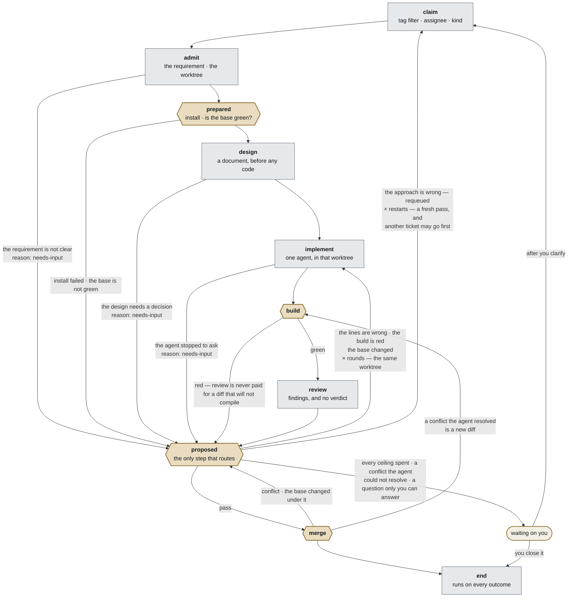

# 0058 — Lingtai is a development pipeline, and a pass is ten steps

**Status** accepted · 2026-09-22, accepted 2026-09-23 · it was `proposed` while
§2's division was still being argued — three drafts — and while
§What-is-not-decided held *plugins that are only correct together*, which
[0061](0061-the-recipe-is-the-pipeline.md) §4 retired by reading the code:
`base` is one value that flows, not two settings that must agree. · **revises
[0015](0015-five-gates-and-two-extensions.md)'s framing and none of its rules**

Lingtai is not a general workflow engine with five extension points. It is a
development pipeline whose sequence is fixed and whose every step is configured
by plugins. What the pipeline keeps for itself is the order, and which steps may
refuse — because a refusal costs a fix round, holds the ticket and reaches a
person, and none of that is a plugin's to invent.

## Context

### The thing that got built is git-, diff- and issue-shaped

Every station names something specific to software development, and none of
them would survive being asked to run a different kind of work:

```
claim        an issue is taken, with its labels deciding priority
admit        a gate point
worktree     cut from a git mirror, at a base ref
prepared     a package manager's install
implement    an agent writes code and commits to a branch
proposed     a build runs; a reviewer reads a **diff**
merge        a gate point
merge lane   the base is merged in, verified, merged out
end          a **GitHub issue** is closed and labelled
```

[0015](0015-five-gates-and-two-extensions.md) framed this as *five gates and two
extensions* — a workflow engine whose points a plugin attaches to. That framing
is what makes `admit` and `merge` read as configurable equals of `proposed`, and
it is what left `worktree`, `implement` and the merge lane out of the model
entirely: they are not extension points, so under that framing they are not
anything.

**The rules 0015 set are all kept.** The set of gate points is closed; a plugin
may do exactly two things. What changes is that the document no longer claims
the pipeline is general, and the stations 0015 had no word for get one.

### The board cannot draw what the model does not name

`apps/board/src/app/rail.tsx:109` draws `points.map(...)` — five segments, one
per gate point — and highlights the one whose name matches the fold's current
label. During a fix round that label is `fixing round 1 of 3`, which is not one
of the five, so **no segment is marked and the eye lands on the last green one**.
Observed on `#179` on 2026-09-22: the rail read as stopped at `prepared` while
the run was eighteen minutes into a fix round at `proposed`.

The fold is not wrong — `progress.ts:345` sets that label deliberately, and
`task_view.note` carries it. There is no rule on the five-segment bar for it.

**The stations the rail cannot draw are where the time goes.** From
[012](../experiments/012-where-the-turns-go.md): an implementing run is 44–67
turns and a fix round 31, together essentially all of a pass, while the gates
are three commands.

### Most of the pipeline is already on the log

Eight of the ten steps append events today:

```
claim        WorkItemClaimed                                          263
admit        — no event of its own; the worktree's path rides on RunStarted
prepared     GateRequested · GateStarted · GatePassed · GateFailed
design       — does not exist yet
implement    RunStarted 260 · RunFinished 227
build        the `build` action at proposed: 395 runs, 34 refusals
review       the `review` action at proposed: 318 runs, 231 refusals
proposed     FixRequested 203 · FixApplied 202 · FixDeclined 24
merge        IntegrationAttempted 153 · Succeeded 123 · Refused 31
end          EndActionsResolved                                       237
```

**Only `design` is genuinely new.** `build` and `review` are two actions at one
point today and become two steps; `proposed` keeps its name and takes over the
routing that `run-once.ts` does now.

So the vocabulary below is mostly a name for what the log already records.

## Decision

### 1. The workflow is fixed, and it is a development workflow

Lingtai does not offer a workflow builder. It offers **one pipeline, whose
stations are known in advance**, and configures each of them for the repository
it is pointed at. A project that needs a different pipeline is not a project
Lingtai serves.

This is a narrowing, and it is the honest description of what exists. It also
buys what a general engine cannot: **the system can propose the configuration**,
because it knows what each station is for. `#161` already does this for the gate
points — reading the repository's scripts, labels and default branch.

### 2. Every step is a step. The workflow fixes which of them may refuse

There are not two classes of node. **There is one — a step — and plugins decide
what it does.** What the workflow fixes, and a plugin may not change, is:

- **the sequence**, and
- **which steps may refuse**, and **what a refusal buys**.

**Refusal is not an ordinary return value**, which is why it cannot be a
plugin's to invent. In this codebase a refusal is a chain of real consequences:
it buys a fix round (~31 turns, ~$3.40), it holds the work item, and it reaches
a person on the board. If a `claim` plugin could "refuse", none of that has a
meaning. So the set of refusing steps is part of the fixed pipeline, and a
plugin at a refusing step supplies the *judgement*, never the *consequence*.

This replaces an earlier draft of this section that split stations into *gate
points* and *work stations*. That split was the wrong shape twice over: it made
`claim` unconfigurable, when swapping tag-pickup for assignee-pickup is the
plainest thing a project wants; and it could not place the merge lane, which
does work and does refuse. **The distinction that is real is between kinds of
outcome, not kinds of node.**

### 2b. The core is the sequence and the outcome rules. Everything that acts is a plugin

List what each step does and you have listed everything Lingtai does.
**The list lives in [0061](0061-the-recipe-is-the-pipeline.md) §3** — this
section had a copy of it and the copy went stale within a day, saying that
`proposed`'s ceilings were a plugin after 0061 had made them the workflow's.
One table, in the ADR that decides the file it is written in.

**Lingtai ships that whole set, and the set is exactly today's behaviour.** A
recipe that says nothing gets it. A project changes a step by naming a
different plugin there, which is what makes one pipeline serve repositories
that want different things.

**This unifies something that is a special case today.** The six gate action
kinds — `run:`, `agent:`, `watch:`, `human:`, `close:`, `labels:` — are six
built-in plugins, and [0059](0059-a-point-carries-only-the-kinds-it-runs.md)'s
rule (*a kind a point does not run is refused when the recipe resolves*) becomes
one rule rather than two: **a step refuses a plugin it cannot run.**

### 3. The ten steps are the vocabulary, shared by the UI, the recipe and the log

```
1   claim        ─ pick the ticket
2   admit        ─ start work on it; the worktree is cut here
3   prepared     ─ REFUSES · the tree is ready to be worked in
4   design       ─ a document, before any code — or nothing, which is an answer
5   implement    ─ one agent, in that worktree
6   build        ─ REFUSES
7   review       ─ reads the diff, returns findings, judges nothing
8   proposed     ─ REFUSES · the only step that routes
9   merge        ─ REFUSES
10  end          ─ runs on every outcome, and cannot refuse
    waiting      ─ not a step: where a pass rests until a person moves it
```

**Four steps may refuse, and every refusal goes to `proposed`.** `prepared` is
one of them and an earlier draft of this list left it out — it refuses when the
install fails or the base is not green, which is `README.md`'s *refuse before
money is spent* and the cheapest refusal in the pass. That is what
makes the loops bounded: each one passes through the workflow check, which is
where the ceilings live. Today those ceilings are `buyRound` and `passCeiling`
inside `run-once.ts`, visible to nobody.

**And a step that did not finish goes to `proposed` too, which is not the same
thing.** `implement` can stop and ask — `RunAwaitingInput` (`events.ts:409`) —
and that is no judgement about the change, so it is not a refusal. It is
[0057](0057-a-gate-that-did-not-finish.md)'s class one level up: the step ends
carrying `reason: needs-input`, and **`proposed` decides whether a person is
worth interrupting**, or whether the agent should go round again stating its
assumption. Some projects would rather be asked; some would rather read the
assumption in the diff. That is a judgement, so it belongs to the step that
judges.

**`review` judging nothing is the change with the most evidence behind it.**
Today a review's verdict *is* the decision — which is why a reviewer that
crashed still bought a fix round: **10% of `review` refusals in 14 days carried
no findings at all**, 24 of them ([012 §4](../experiments/012-where-the-turns-go.md),
and [0057](0057-a-gate-that-did-not-finish.md) is the narrow fix). With the
decision in its own step, a review that returns nothing is a review that found
nothing, and the step that decides can see that.

**`design` may produce nothing, and that is how *does this need designing* gets
answered without a branch.** The step always runs; its plugin may return an
empty document. `implement` is handed two things — the issue's own text and the
design — and when the design is empty it works from the issue, which is exactly
what every pass does today. So a typo fix costs no design and a project that
wants none at all writes `design: []` (§5 of
[0061](0061-the-recipe-is-the-pipeline.md)): **the sequence stays fixed, and the
judgement sits in the one thing that could make it.** A conditional step would
have put that judgement in the workflow, where nothing knows enough to make it.

**`build` before `review`, and a red build skips it.** Not because build is
quick — measured over 14 days it is the slower of the two, median 313s against
review's 149s — but because it spends no tokens where a review spends an agent.
The recipe already says this in as many words: *a diff that does not compile is
never paid to be reviewed*.

**And the agent still runs the build itself while it works** — 1–9 times in a
pass that lands, 35–57 in one that enters the fix loop. That is a tool, not the
step. The step's run is the independent one, and it is the one that appends a
verdict with evidence. [Experiment 001](../experiments/001-cold-review-issue-58.md)'s
argument for the cold reviewer — *self-review after ~89 turns of committed
reasoning is not a second opinion* — is the same argument here: the agent's own
green is not evidence that the tree is green.

### 3b. The pipeline, drawn



**Every path into `end` has been through `build` and `review`.** That is the
invariant the drawing exists to make checkable, and the edge from `merge` back
to `build` is what buys it: a conflict the agent resolved is code written after
the review passed, so it goes round again.

**The hexagons are the three steps that may refuse, and all three arrive at the
same place.** That is the property worth keeping: `proposed` is the only step
that routes, so every loop in the drawing passes through the workflow check, and
**no loop is unbounded**. It is also why the log ends up complete — `proposed`
runs on the way through as well as on the way back, so a pass that sailed
through has a recorded decision saying it did.

**`waiting` has exactly one way in, and that is the property to keep.** Only
`proposed` may decide that a person is next, so *is this worth interrupting
somebody over* is asked in one place, by something a recipe can configure.

Two edges used to go round it — `admit` when the requirement was not clear, and
`design` when the design needed a decision — and the argument that removed them
is the one that already covers `implement`: **both of those steps run an agent,
so both have already spent.** *We paid once; do we pay again, or is this a
question only a person can close?* is the same question in all three places,
and it is a judgement. A step that reaches `waiting` on its own is a step
deciding how to spend your attention with no ceiling and no plugin.

**A restart is a requeue, and the next ticket taken may not be this one.** The
edge back to `claim` releases the item ([0040](0040-rounds-bound-depth-restarts-bound-breadth.md));
the queue's next pass orders by kind and then by number as it always does, so a
higher-priority ticket opened in the meantime goes first. That is why
`restarts` is written on `claim` and reads *this item may be claimed twice*
rather than *this pass may run twice* — the two are different, and only the
first one is true.

**And a destination the judge may choose needs a bound on the step it goes
to** (§the-bound-sits-on-the-step-it-bounds, [0061](0061-the-recipe-is-the-pipeline.md) §2).
If `proposed` may send a pass back to `design`, then `design` carries its own
`rounds`, exactly as `implement` does.

### 3c. Every step that does not simply pass reports a reason, and the reason survives the routing

A step ends one of three ways: it passed, it refused, or it did not finish. The
last two both arrive at `proposed`, and **what happened has to arrive intact**.
A route that forgets is a person reading *waiting on you* with no way to learn
why without opening a run log.

```
build      red                          a refusal
review     findings                     a refusal
merge      gate-failed | conflict       a refusal
prepared   install failed               a refusal
admit      needs-input                  did not finish — 0057's class, not a refusal
design     needs-input                  the same
implement  needs-input                  the same
```

One shape for all four: a machine-readable `reason` beside human-readable
detail.

The log already carries both halves, which is the shape to keep:

```
IntegrationRefused { branch, workItemId,
                     reason: "gate-failed" | "conflict",     ← machine-readable
                     detail: "build: pnpm typecheck && pnpm test exited 1 …" }  ← the words
```

**Machine-readable, because `proposed` routes on it.** Human-readable, because
`waiting` displays it. [0043](0043-evidence-is-plain-text.md) already says
evidence is plain text and not a structure to be parsed; the classification
beside it is what lets a step decide without reading English, which is
[0031 §1](0031-a-run-that-never-started.md)'s rule.

**And the distribution says the drawing's label is the minority case.** Over
the whole log, `merge` has refused 32 times:

```
26  gate-failed   the base came in and the change no longer holds
 6  conflict      git could not merge it
```

So *"the agent could not resolve the conflict"* is 6 of 32. The common merge
failure is that **somebody else's work landed and this diff stopped being
true** — a clean textual merge that then fails its build. There is no conflict
marker for an agent to look at, and what it needs is an ordinary fix round
against the new base.

**So `merge` does not decide; it reports a `reason` and `proposed` routes on
it.** That is the whole of the answer to *should an agent resolve the conflict*:

| `reason` | share | where `proposed` sends it |
|---|---|---|
| `gate-failed` | 26 / 32 | `implement`, carrying the failure and the new base. An ordinary round |
| `conflict`, text | 6 / 32 | resolved, then **back through `build` and `review`** — see below |
| `conflict`, intent | — | `waiting`, carrying what each side changed |
| `needs-input` | from `admit`, `design` or `implement` | the judge's call: `waiting` with the question, or that step again with *state your assumption* |

**The third row is the one an agent must not take.** Two changes that edited the
same decision differently — one setting `rounds: 2` where the other set `5` —
produce text an agent can merge and an intent it cannot know. That is not a
code question, and an agent answering it is an agent guessing. This repository
met the same shape today and did the right thing: `#179`'s branch found
`logConfigured()` pulled two ways, **wrote down both and deferred to `#214`**
rather than deciding.

**And a resolved conflict is code no reviewer read**, because `review` has
already passed by the time `merge` runs. With 6 conflicts in the whole log,
buying an unreviewed path into `main` to save six interruptions is a poor
trade — unless the resolution re-enters the loop at `proposed`, which the
drawing already has it do. Then the plugin can stay and the hole closes.

**A conflict the agent resolves is a new diff, and it goes back to `build`.**
That is the one edge that closes the hole above rather than describing it:
`review` passed on the diff as it was, and the resolution is code written
after. Sending it round again costs a build and a review — measured, 313s and
149s — on a path the whole log has taken **six times**. Against that, it is
what makes the invariant say itself: **every path into `end` has been through
`build` and `review`.**

**What actually cleared a conflict here was not a resolver.** The one time the
loop tried (`wi-lingtai-87`), it appended `RepairRequested conflict`, released
the item, and the ticket was claimed again — and a new pass cuts its worktree
from `origin/<base>` ([0039](0039-the-worktree-is-the-whole-of-a-pass.md)), so
the rebase is a free side effect and the conflict is gone. It landed two claims
later at `2d771db`.

### 4. Init configures every step; the person overrides any of it

At `lingtai init` and at `lingtai add`, the repository is read and each step
gets a proposed set of plugins — the package manager for `prepared`, the default
branch for `worktree`, the signed-in runtime for `implement`, the test script
for `proposed`. The person may change any of it, and what they change is
recorded in the recipe exactly as the gates are.

**Detected is a default, not a replacement for being told** —
[0046 §3](0046-lingtai-is-personal.md)'s rule, applied to every step rather
than to `runtime.agent` alone.

[0053](0053-the-recipe-chooses-the-agent-for-each-role.md) is already the first
instance of this: it configures the `implement` station — which agent, which
model, which limits — and it is accepted with its implementation on an unmerged
branch. **It is not superseded by this ADR; it is the pattern this one
generalises.**

### 5. What this revises, and what it leaves alone

**[0015](0015-five-gates-and-two-extensions.md) is revised, not worked around.**
It says *a plugin may do exactly two things*, and the first is a gate action
attached to one of five points. Under §2b a plugin attaches to **any of the ten
steps**. The number changes; the shape does not — a plugin still either runs in
the loop and the loop waits for it, or it runs off the log and cannot affect
the outcome. The `Gate` interface 0015 names as the contract is the plugin
contract still.

**The closed set survives, and it is the set of steps.** 0015's argument was
that a plugin can rely on the points because the set never grows. That argument
is what §1 buys by narrowing the product: the pipeline is fixed, so the ten are
closed the way the five were.

**[0047](0047-the-recipe-a-run-got-is-on-the-log.md) needs `GatesResolved` to
grow, and this is the concrete break.** It records five points and asserts it:

```ts
points: z.array(z.object({ gate: GatePoint, actions: z.array(z.string()) })).length(5)
```

0047's claim is *what a run was given is on the log*. If every step's behaviour
is a plugin and the log records only five of ten, then **the log stops saying
what the run was actually configured to do** — whether `claim` picked by tag or
by assignee would be nowhere. That `.length(5)` is a hard assertion and has to
move with this ADR, or 0047 quietly becomes false.

**It moves without an upcaster.**
[0061](0061-the-recipe-is-the-pipeline.md) §7 spends this log instead: the
shape changes, the log is reset for the third time, and the measurements are
folded into a file first. Nobody should read this section and go and write an
upcaster — the mechanism stays for a Lingtai whose log nobody may reset.

Left alone:

- **A configured thing that silently does not run is Lingtai's bug**
  ([0016 §4](0016-the-settled-model.md)). The ten silent cells `#61` measured
  are closed — [0059](0059-a-point-carries-only-the-kinds-it-runs.md) landed on
  2026-09-22. §2b folds its rule into the general one: **a step refuses a plugin
  it cannot run.**
- **The recipe is the machine's** ([0046 §3](0046-lingtai-is-personal.md)),
  at `~/.lingtai/<project>/recipe.yml`.
- **The worktree is the whole of a pass**
  ([0039](0039-the-worktree-is-the-whole-of-a-pass.md)). `admit` cuts it; it
  outlives that step and encloses everything to the merge. A plugin whose result
  lives past its own step is a thing the plugin contract has to admit exists.

## Consequences

**The rail can line up before any of this is built.** Eight of the ten steps are
already on the log, so drawing a pass as it happens needs no schema change and
nothing from 0015. Worth doing first for its own sake and as a test of §3's
names: if `implement` or `proposed` reads wrong on a card, it is far cheaper to
learn that before the recipe carries the word.

**`review` stops deciding, and three things follow.**
[#223](https://github.com/steven-zhc/lingtai/issues/223) changes shape — it was
*add a field to the reviewer's contract saying lines-or-approach*, and becomes
*that judgement is a plugin at `proposed`*, which is better because the reviewer
keeps one job. [0057](0057-a-gate-that-did-not-finish.md)'s narrow fix stays
correct and stops being load-bearing. And the ceilings come out of
`run-once.ts` into a plugin a person can read.

**The recipe grows a shape it does not have.** `gates:` has five keys; steps
have ten, and the two that are not gates today (`design`, `implement`) carry
plugins. Whether steps sit beside `gates:` or replace it is not decided here.

**Two test runs per attempt, and one of them may not earn it.** `prepared` runs
the suite against the base and `build` runs it against the change — median 313s
each. Over the 263 claims in the 14 days measured, the first is about **23 hours
of wall clock** to catch a base that was already broken, which `build` catches
anyway one agent run later. Keeping it is a choice; it should be a stated one.

**Every ADR that says "five points" needs re-reading**, not rewriting: most mean
gate points and are correct. The ones to check use "point" to mean "stage".

## What is not decided

- **Whether the router is a step at all.** Every step that does not simply pass
  now hands its outcome to `proposed` — six of them. A thing that runs after
  every step is a rule, not a station, and on that reading `proposed` is two
  things this ADR merged: **the step where a proposed change is inspected**
  (`human:` approval, `watch:`, the tamper check) and **the router**. Splitting
  them would leave every rule here true and redraw §3b. It is not done now
  because the drawing is worth more settled than symmetrical, and because
  nothing in the plan is blocked by it.

- **Some plugins are only correct together.** `admit`'s worktree and `merge`'s
  `git merge` must agree about one repository, branch and base; `prepared`'s
  install and `build`'s test must agree about one package manager. A model that
  lets either be swapped alone lets a person assemble a pipeline that is legal,
  passes `doctor`, and breaks on the first merge. The shape of the answer is
  probably the one the code already has — `gatesFromRecipe(…, deps)` refuses by
  name when a dependency is missing — widened from within-a-step to across
  steps. **This is the largest open question here.**
- **Where plugins live in the recipe**, and whether their configuration is
  hashed into `configHash` the way gates are. It follows §5's `GatesResolved`
  point and should be settled with it.
- **Whether `prepared` should test the base at all**, given the number in
  Consequences.
- **What `end` does for a ticket that a person closed from `waiting`** — it runs,
  but `close:` and `labels:` were written for a ticket that landed.
- **Whether a plugin may replace a step wholesale** rather than configure it.
  0015 allows two powers; this would be a third.
