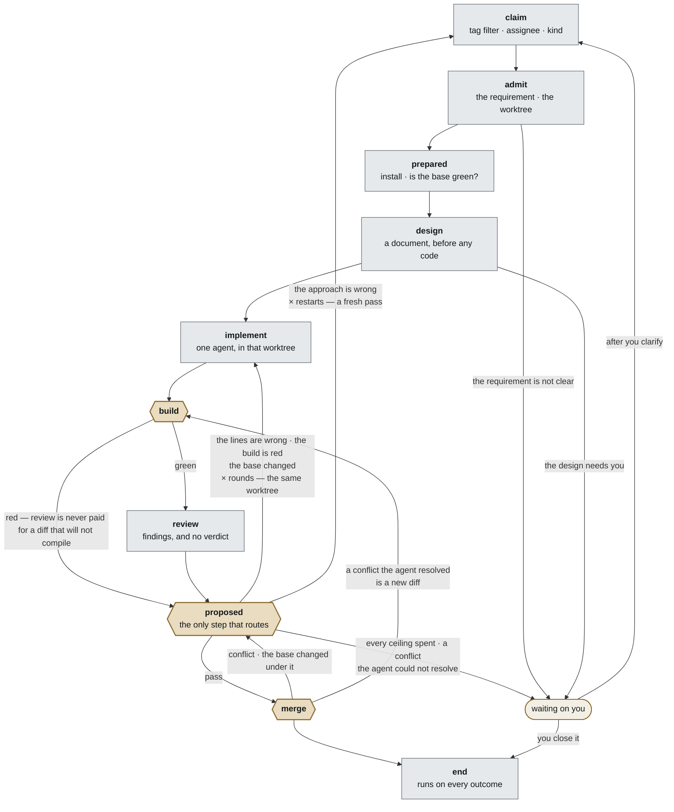

# 0058 — 灵台是一条开发流水线，一趟 pass 有十步

**状态** **提议中（proposed）** · 2026-09-22 · **本仓库第一份不是 `accepted` 的
ADR**，这是有意的：§2 与它所服务的那个人来回改了三稿，而§尚未决定里那一条仍然
决定着其余部分能不能建。 ·
**修正 [0015](../decisions/0015-five-gates-and-two-extensions.md) 的框架表述，不动它的任何规则**

> 这是 [0058](../decisions/0058-lingtai-is-a-development-pipeline.md) 的中文本。
> **英文本是正本**；两者意见不一致时以英文本为准。

灵台不是一个带五个扩展点的通用工作流引擎。它是一条**顺序固定的开发流水线，而
每一步做什么由插件决定**。流水线为自己保留的只有两样：顺序，以及**哪几步可以
拒绝** —— 因为一次拒绝要买一轮修复、扣住这张票、并且会走到一个人面前，这些
都不是插件可以自己发明的。

## 背景

### 造出来的东西是 git、diff 和 issue 形状的

每一站都指向软件开发特有的东西，没有一站经得起"换一种工作"的追问：

```
claim        取一张 issue，它的标签决定优先级
admit        一个 gate point
worktree     从 git 镜像按 base ref 切出工作树
prepared     跑一个包管理器的 install
implement    一个 agent 写代码并提交到分支
proposed     跑构建；一个 reviewer 读 **diff**
merge        一个 gate point
merge lane   把 base 并进来、verify、再并出去
end          关掉并标记一张 **GitHub issue**
```

[0015](../decisions/0015-five-gates-and-two-extensions.md) 把这件事表述成
*五个 gate 和两种扩展* —— 一个工作流引擎，插件往它的点上挂东西。正是这个表述
让 `admit` 和 `merge` 读起来像是 `proposed` 的可配置同类，也正是它把
`worktree`、`implement` 和 merge lane 整个排除在模型之外：它们不是扩展点，
所以在那个表述下它们什么都不是。

**0015 立下的规则全部保留。** gate point 的集合是封闭的；插件只能做两件事。
变的是这份文档不再声称这条流水线是通用的，而 0015 没有词可称呼的那些站点
得到了名字。

### 看板画不出模型没有命名的东西

`apps/board/src/app/rail.tsx:109` 画的是 `points.map(...)` —— 五段，一段一个
gate point —— 并把名字与折叠的当前标签相符的那一段点亮。而在修复轮里那个标签是
`fixing round 1 of 3`，它不是那五个中的任何一个，于是**没有任何一段被标记，
眼睛落在最后一段绿色上**。2026-09-22 在 `#179` 上观察到：rail 读起来像停在
`prepared`，而那趟 run 已经在 `proposed` 的修复轮里跑了十八分钟。

折叠本身没错 —— `progress.ts:345` 是特意设这个标签的，`task_view.note` 里
也带着它。是那条五段的尺子上没有这一格。

**rail 画不出的那些站，正是时间的去处。** 据
[012](../experiments/012-where-the-turns-go.md)：一次实现 run 是 44–67 turns，
一个修复轮 31 turns，加起来基本就是一趟 pass 的全部，而那些 gate 不过是三条命令。

### 流水线的大部分早已在日志上

十步里有八步今天就在追加事件：

```
claim        WorkItemClaimed                                          263
admit        —— 没有自己的事件；工作树的路径挂在 RunStarted 上
prepared     GateRequested · GateStarted · GatePassed · GateFailed
design       —— 还不存在
implement    RunStarted 260 · RunFinished 227
build        proposed 上的 `build` action：跑了 395 次，拒绝 34 次
review       proposed 上的 `review` action：跑了 318 次，拒绝 231 次
proposed     FixRequested 203 · FixApplied 202 · FixDeclined 24
merge        IntegrationAttempted 153 · Succeeded 123 · Refused 31
end          EndActionsResolved                                       237
```

**真正是新的只有 `design`。** `build` 和 `review` 今天是一个点上的两个 action，
将来成为两步；`proposed` 保留它的名字，并接手 `run-once.ts` 现在做的那件路由。

所以下面这套词汇表，大半只是给日志已经记录的东西一个名字。

## 决定

### 1. 工作流是固定的，而且它是一条开发工作流

灵台不提供工作流编排器。它提供**一条站点预先已知的流水线**，并为它所指向的
仓库配置每一站。需要另一种流水线的项目，不是灵台服务的项目。

这是一次收窄，而且它是对现存之物的诚实描述。它同时买到了通用引擎买不到的
东西：**系统能够提议配置，因为它知道每一站是干什么的。** `#161` 对 gate point
已经在这么做了 —— 读仓库的脚本、标签和默认分支。

### 2. 每一步都只是一步。工作流固定的是其中哪几步可以拒绝

**不存在两类节点。只有一类 —— 步（step）—— 而每一步做什么由插件决定。**
工作流固定下来、插件不得更改的，是这两件：

- **顺序**，以及
- **哪几步可以拒绝**，和**一次拒绝买到什么**。

**拒绝不是一个普通的返回值**，这正是它不能交给插件去发明的原因。在这套代码里，
一次拒绝是一串真实后果：它买下一轮修复（约 31 turns、约 $3.40），它扣住这个
work item，它会出现在看板上等一个人。如果一个 `claim` 插件也能"拒绝"，上面这些
就都没有意义了。所以**会拒绝的那几步属于固定的流水线**，而一个挂在会拒绝的步上
的插件，提供的是**判断**，永远不是**后果**。

本节替换了早先的一稿 —— 那一稿把站点分成 *gate point* 和 *work station*。那个
分法两头都不对：它让 `claim` 变得不可配置，而把"按标签取票"换成"按 assignee
取票"恰恰是一个项目最朴素的诉求；它也安放不下 merge lane —— merge lane 既干活
又会拒绝。**真实存在的分界是结果的种类，不是节点的种类。**

### 2b. 内核是顺序与结果规则。凡是动手做事的，都是插件

把每一步做什么列出来，你也就列完了灵台做的全部事情：

| 步 | 插件 |
|---|---|
| `claim` | 标签过滤 · assignee · kind |
| `admit` | 需求分析 · git worktree |
| `prepared` | `pnpm install` · `pnpm test` |
| `design` | 生成设计文档 |
| `implement` | 调用 agent |
| `build` | `pnpm build` · `pnpm test` |
| `review` | 冷读 reviewer |
| `proposed` | 工作流判断 · 行的毛病还是路子的毛病 |
| `merge` | `git merge` · 一个解冲突的 agent |
| `end` | 更新 GitHub |

**灵台把这一整套都发出去，而且这一套正好就是今天的行为。** 一份什么都没写的
recipe 得到的就是它。一个项目要改某一步，就在那一步上换一个插件名 —— 这正是
一条流水线得以服务诉求不同的多个仓库的原因。

**这还统一了今天的一个特例。** 六种 gate action —— `run:`、`agent:`、`watch:`、
`human:`、`close:`、`labels:` —— 就是六个内置插件，而
[0059](../decisions/0059-a-point-carries-only-the-kinds-it-runs.md) 的规则
（*一个点跑不了的 kind，在 recipe 解析时就被拒绝*）从此不是两条规则而是一条：
**一步拒绝它跑不了的插件。**

### 3. 十步就是那套词汇表，UI、recipe 与日志共用

```
1   claim        ─ 取票
2   admit        ─ 开始做它；工作树在这里切出
3   prepared     ─ 树已经可以动工
4   design       ─ 一份文档，先于任何代码
5   implement    ─ 一个 agent，在那棵工作树里
6   build        ─ 会拒绝
7   review       ─ 读 diff，交回 findings，不做裁决
8   proposed     ─ 会拒绝 · 唯一做路由的一步
9   merge        ─ 会拒绝
10  end          ─ 每一种结局都会跑到它，且不能拒绝
    waiting      ─ 不是一步：一趟 pass 等人来推时停在这里
```

**三步可以拒绝，而每一次拒绝都走向 `proposed`。** 这正是那些环路有界的原因：
每一条都要穿过那次工作流判断，而上限就住在那里。今天这些上限是 `run-once.ts`
里的 `buyRound` 和 `passCeiling`，谁也看不见。

**`review` 不再做裁决，是这里证据最硬的一处改动。** 今天一次 review 的裁决
*就是*决定 —— 所以一个崩掉的 reviewer 照样买走一轮修复：**14 天里 10% 的
`review` 拒绝不含任何 finding**，24 次（[012 §4](../experiments/012-where-the-turns-go.md)，
而 [0057](../decisions/0057-a-gate-that-did-not-finish.md) 是那个窄口的修法）。
把决定放进它自己的一步之后，一次什么都没交回来的 review 就是一次什么都没发现的
review，而做决定的那一步看得见这件事。

**`build` 排在 `review` 前面，构建红了就跳过 review。** 不是因为 build 快 ——
14 天量下来它反而是慢的那个，中位数 313s 对 review 的 149s —— 而是因为它不烧
token，而一次 review 要花掉一个 agent。recipe 里早就是这么写的：*一份编译不过的
diff，绝不花钱去评审*。

**而 agent 干活时自己仍然会跑构建** —— 顺利落地的一趟里 1–9 次，掉进修复循环的
一趟里 35–57 次。那是一件工具，不是那一步。那一步跑的是独立的那一次，也是唯一
带证据往日志上追加裁决的那一次。[实验 001](../experiments/001-cold-review-issue-58.md)
为冷读 reviewer 给出的论证 —— *在 89 个 turn 的投入之后自评，不构成第二个意见*
—— 在这里是同一个论证：**agent 自己跑绿了，不是这棵树是绿的证据。**

### 3b. 这条流水线，画出来



**每一条通向 `end` 的路，都经过 `build` 和 `review`。** 这就是这张图存在的理由
—— 一条可以被检查的不变式；而 `merge` 回到 `build` 的那条边就是买下它的东西：
agent 解掉的冲突，是 review 通过之后才写下的代码，所以它得再走一圈。

**三个六边形是可以拒绝的三步，而它们都到达同一个地方。** 这是值得守住的性质：
`proposed` 是唯一做路由的一步，所以图里的每一个环都穿过那次工作流判断，
**没有一个环是无界的**。这也是日志最终得以完整的原因 —— `proposed` 不只在
回头的路上跑，顺流而下时也跑，所以一趟一路顺畅的 pass 同样留下一条"它确实顺畅"
的决定记录。

**没有任何东西直接拒绝到 `waiting`。** 一次冲突、一次红构建，都是关于这次改动的
判断，它们去判断该去的地方；只有那个数着上限的步，才有资格决定下一个该是人。

### 3c. 一次拒绝带着它的理由，而理由在路由中存活

`merge` 拒绝、`proposed` 决定、`waiting` 给人看 —— 而**出了什么事必须完好无损地
抵达这条链的末端**。一条会遗忘的路由，就是一个人读到"等你"却无从得知为什么，
除非去翻 run log。

日志上两半都已经带着了，这就是要保留的形状：

```
IntegrationRefused { branch, workItemId,
                     reason: "gate-failed" | "conflict",     ← 机器读
                     detail: "build: pnpm typecheck && pnpm test exited 1 …" }  ← 人读
```

**机器可读，因为 `proposed` 要按它路由。** 人可读，因为 `waiting` 要显示它。
[0043](../decisions/0043-evidence-is-plain-text.md) 早已规定证据是纯文本、不是
一个待解析的结构；它旁边那个分类，才是让一步不必读英文就能决定的东西，也就是
[0031 §1](../decisions/0031-a-run-that-never-started.md) 的规矩。

**而分布告诉我们，图上那个标签其实是少数情况。** 整条日志上，`merge` 一共
拒绝过 32 次：

```
26  gate-failed   base 并进来了，这次改动不再成立
 6  conflict      git 合不上
```

所以*"agent 解不了这个冲突"*是 32 里的 6。常见的 merge 失败是**别人的工作落地了，
而这份 diff 不再为真** —— 文本上干干净净地合上了，然后构建挂了。根本没有冲突
标记可供 agent 端详，它需要的是针对新 base 的一轮普通修复。

**所以 `merge` 不做决定；它报一个 `reason`，由 `proposed` 按它路由。** 这就是
*要不要让 agent 去解冲突*的全部答案：

| `reason` | 占比 | `proposed` 把它送去哪 |
|---|---|---|
| `gate-failed` | 26 / 32 | `implement`，带上失败内容和新的 base。一轮普通修复 |
| `conflict`，文本层面 | 6 / 32 | 解掉，然后**重新过 `build` 和 `review`** —— 见下 |
| `conflict`，意图层面 | — | `waiting`，带上双方各自改了什么 |

**第三行是 agent 绝不能接的那一行。** 两个改动把同一个决定改成了不同的样子 ——
一个写 `rounds: 2`，另一个写 `5` —— 产生的文本 agent 合得了，而其中的意图它
无从知道。那不是一个代码问题，一个去回答它的 agent 就是一个在猜的 agent。本仓库
今天就撞上了同样的形状，并且做对了：`#179` 的分支发现 `logConfigured()` 被两股
力量往两边拉，**把两边都写下来并交给 `#214`**，而不是自己拍板。

**而且一份解完冲突的代码，是没有任何 reviewer 读过的代码** —— 因为 `merge` 跑的
时候，`review` 早就通过了。整条日志上只有 6 次冲突，为了省下六次打扰而买一条
无人评审就进 `main` 的路，是笔坏买卖 —— 除非那份解法重新从 `proposed` 进入
循环，而图上本来就是这么画的。那样插件可以留下，而这个洞被补上。

**一份被 agent 解掉的冲突是一份新 diff，它回到 `build`。** 这是真正把上面那个洞
补上、而不只是描述它的那一条边：`review` 通过的是当时那份 diff，而解冲突写下的
代码在那之后。让它再走一圈，代价是一次 build 加一次 review —— 量过的，313s 和
149s —— 而这条路整条日志一共走过**六次**。相比之下，它买来的是让那条不变式自己
说得出口：**每一条通向 `end` 的路，都经过 `build` 和 `review`。**

**这里真正解掉过冲突的，从来不是什么解冲突器。** 循环唯一一次尝试（`wi-lingtai-87`）
是追加了 `RepairRequested conflict`、释放了这个 item，然后这张票被重新认领 ——
而新的一趟会从 `origin/<base>` 切出它的工作树
（[0039](../decisions/0039-the-worktree-is-the-whole-of-a-pass.md)），于是 rebase
成了免费的副作用，冲突就没了。两次认领之后它在 `2d771db` 落地。

### 4. init 配置每一步，人可以覆盖其中任何一条

在 `lingtai init` 和 `lingtai add` 的时候读取仓库，每一步得到一份被提议的插件 ——
`prepared` 用哪个包管理器、`worktree` 用哪个默认分支、`implement` 用哪个已登录的
runtime、`proposed` 用哪个测试脚本。人可以改动其中任何一项，而改动会像 gate 一样
被记进 recipe。

**检测出来的是默认值，不是"不必被告知"的理由** ——
[0046 §3](../decisions/0046-lingtai-is-personal.md) 的规矩，从只管 `runtime.agent`
推广到每一步。

[0053](../decisions/0053-the-recipe-chooses-the-agent-for-each-role.md)
已经是这条规则的第一个实例：它配置的就是 `implement` 这一站 —— 哪个 agent、
哪个模型、什么限额 —— 而它已被接受，实现就在一个尚未合并的分支上。
**它不被本 ADR 取代；它是本 ADR 所推广的那个范式。**

### 5. 本 ADR 修正什么，又不动什么

**[0015](../decisions/0015-five-gates-and-two-extensions.md) 是被修正，不是被绕开。**
它说*插件只能做两件事*，其中第一件是挂在五个点之一上的 gate action。在 §2b 之下，
一个插件挂在**十步中的任何一步**上。数字变了，形状没变 —— 插件要么跑在循环里、
循环等它，要么跑在日志之外、影响不了结果。0015 指定为契约的那个 `Gate` 接口，
仍然是插件契约。

**封闭集合活了下来，而它就是那个步的集合。** 0015 的论证是：插件可以依赖那些点，
因为集合永不增长。那个论证正是 §1 靠收窄产品买回来的 —— 流水线是固定的，所以
这十步封闭得和那五个点一样。

**[0047](../decisions/0047-the-recipe-a-run-got-is-on-the-log.md) 需要 `GatesResolved`
长大，这是具体的断裂处。** 它记录五个点，并且断言了这一点：

```ts
points: z.array(z.object({ gate: GatePoint, actions: z.array(z.string()) })).length(5)
```

0047 的主张是*一趟 run 拿到的是什么，在日志上*。如果每一步的行为都是插件，
而日志只记十步中的五步，那么**日志就不再说得出这趟 run 到底被配置成什么样** ——
`claim` 是按标签取还是按 assignee 取，将无处可查。那个 `.length(5)` 是一条硬断言，
必须随本 ADR 一起移动，否则 0047 会悄悄变成假的。

不动的部分：

- **一个配置了却静默不运行的东西，是灵台自己的 bug**
  （[0016 §4](../decisions/0016-the-settled-model.md)）。`#61` 量出的那十个静默
  格子已经补上 —— [0059](../decisions/0059-a-point-carries-only-the-kinds-it-runs.md)
  在 2026-09-22 落地。§2b 把它的规则折进那条通用的：**一步拒绝它跑不了的插件。**
- **recipe 是这台机器的**（[0046 §3](../decisions/0046-lingtai-is-personal.md)），
  在 `~/.lingtai/<project>/recipe.yml`。
- **工作树就是一趟 pass 的全部**
  （[0039](../decisions/0039-the-worktree-is-the-whole-of-a-pass.md)）。`admit`
  切出它；它活得比那一步长，并且一直包住到 merge。**一个插件的产物活得比它自己
  那一步长**，这是插件契约必须承认其存在的东西。

## 后果

**rail 的对齐不必等这一切建成。** 十步里八步已经在日志上，所以把一趟 pass
如实画出来不需要改 schema，也不需要 0015 出任何力。这件事本身值得先做，
而且它是对 §3 那套命名的一次检验：如果 `implement` 或 `proposed` 印在卡片上
读着不对，在 recipe 用上这个词之前发现要便宜得多。

**`review` 不再做决定，随之而来三件事。**
[#223](https://github.com/steven-zhc/lingtai/issues/223) 换了形状 —— 它原本是
*给 reviewer 的契约加一个字段，说明是行的毛病还是路子的毛病*，现在变成
*那个判断是 `proposed` 上的一个插件*，这更好，因为 reviewer 只保留一件工作。
[0057](../decisions/0057-a-gate-that-did-not-finish.md) 的窄口修法依然正确，
并且不再承重。而那些上限从 `run-once.ts` 里搬出来，成为一个人读得懂的插件。

**recipe 会长出一个它现在没有的形状。** `gates:` 有五个键，而步有十个，其中今天
不是 gate 的两个（`design`、`implement`）也要带插件。步是与 `gates:` 并列还是
取代它，本 ADR 不决定。

**每次尝试要跑两遍测试，其中一遍未必值。** `prepared` 对着 base 跑一遍套件，
`build` 对着改动再跑一遍 —— 各自中位数 313s。在量过的 14 天、263 次认领里，
前者大约是**23 小时的挂钟时间**，用来抓一个本来就已经坏掉的 base —— 而一次
agent run 之后，`build` 反正也会抓到它。保留它是一个选择；它应该是一个被说出口
的选择。

**每一份写着"五个点"的 ADR 都需要重读一遍**，但不是重写：它们大多指的是 gate
point，而且是对的。要查的是那些用"点"来指"阶段"的地方。

## 尚未决定

- **有些插件只有配在一起才正确。** `admit` 的 worktree 和 `merge` 的 `git merge`
  必须对同一个仓库、分支和 base 达成一致；`prepared` 的 install 和 `build` 的
  test 必须对同一个包管理器达成一致。一个允许其中任何一个被单独替换的模型，
  就允许一个人拼出一条合法的、过得了 `doctor` 的、在第一次 merge 时炸掉的流水线。
  答案的形状大概就是代码里已经有的那个 —— `gatesFromRecipe(…, deps)` 在依赖缺失
  时按名字拒绝 —— 只是要从"一步之内"扩到"跨步之间"。**这是这里最大的一个未决
  问题。**
- **插件在 recipe 里住哪**，以及它们的配置要不要像 gate 那样被算进 `configHash`。
  它跟着 §5 的 `GatesResolved` 那一点走，应当与之一并解决。
- **`prepared` 到底该不该测 base**，鉴于"后果"里那个数字。
- **一张被人从 `waiting` 关掉的票，`end` 该为它做什么** —— 它会跑，但 `close:`
  和 `labels:` 是为一张落了地的票写的。
- **一个插件能不能整个替换掉一步**，而不只是配置它。0015 给了插件两种权力，
  这会是第三种。
